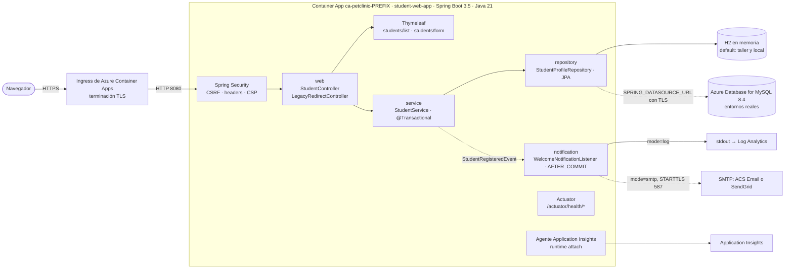
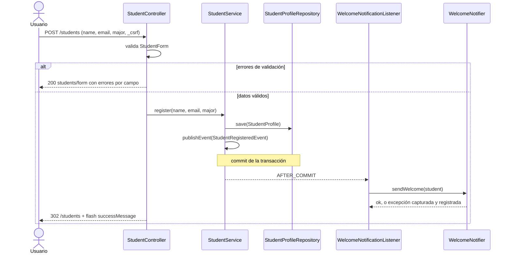

# Arquitectura target: Student Web App (Java)

> **Fase 2: Planning** · Fecha: 2026-10-04 · Agente: `@spring-legacy-planning` · Estado: **aprobada** (se aceptaron las recomendaciones)
>
> - Insumos: [assessment-summary.md](assessment-summary.md), [blockers.md](blockers.md), [features/](features/)
> - Alcance y paridad: [MIGRATION-SCOPE.md](MIGRATION-SCOPE.md)
> - Plan: [migration-plan.md](migration-plan.md)
> - Riesgos: [risks.md](risks.md)

## Resumen

Student Web App pasa de Spring 5.3 + Ant + WAR sobre Open Liberty a un **JAR ejecutable de Spring Boot 3.5 sobre Java 21**, desplegable en Azure Container Apps en el puerto 8080.

La estrategia es **híbrida**: un proyecto Maven nuevo en `src/student-web-app/` que parte del código legacy, se transforma con OpenRewrite y se refactoriza por feature. `legacy/` no se toca.

## Índice de decisiones

| ADR | Decisión |
| --- | --- |
| [ADR-001](adr/ADR-001-java-target.md) | Java 21 (Eclipse Temurin) |
| [ADR-002](adr/ADR-002-spring-boot-version.md) | Spring Boot 3.5.16 (sin soporte OSS; mitigación obligatoria) |
| [ADR-003](adr/ADR-003-namespace-strategy.md) | `javax` → `jakarta` con OpenRewrite, después de un `pom.xml` baseline |
| [ADR-004](adr/ADR-004-upgrade-vs-greenfield.md) | Estrategia híbrida en `src/student-web-app/` y corte directo |
| [ADR-005](adr/ADR-005-hibernate-strategy.md) | Spring Data JPA (Hibernate 6.6) con anotaciones; H2 por defecto y MySQL 8.4 opcional; Flyway |
| [ADR-006](adr/ADR-006-packaging.md) | JAR ejecutable y Dockerfile multi-stage, puerto 8080 |
| [ADR-007](adr/ADR-007-cve-remediation.md) | Remediación de CVEs y dependencias prohibidas |
| [ADR-008](adr/ADR-008-test-strategy.md) | JUnit 5, Mockito, MockMvc y Testcontainers |
| [ADR-009](adr/ADR-009-web-layer-thymeleaf.md) | Spring MVC + Thymeleaf; un camino por caso de uso; 301 para URLs legacy |
| [ADR-010](adr/ADR-010-welcome-notification.md) | Notificación de bienvenida desacoplada (log por defecto, SMTP opcional) |
| [ADR-011](adr/ADR-011-security-baseline.md) | Línea base de seguridad: CSRF, headers, validación, errores y secretos |
| [ADR-012](adr/ADR-012-config-observability.md) | Configuración 12-factor, Actuator y Application Insights |

### Equivalencias para `@spring-legacy-migration`

La definición de ese agente usa números de ADR genéricos del playbook. En este proyecto equivalen a:

| Lo que cita el agente | Dónde está en este proyecto |
| --- | --- |
| "ADR-002: upgrade in-place vs greenfield" | [ADR-004](adr/ADR-004-upgrade-vs-greenfield.md). Es híbrido: usar la ruta *greenfield* del agente en `src/student-web-app/`, partiendo del código legacy copiado, y **no** crear `legacy.original/` |
| "ADR-006: `.hbm.xml` → anotaciones" | [ADR-005](adr/ADR-005-hibernate-strategy.md). No hay Hibernate legacy; el cambio es iBATIS → JPA |
| "ADR-007: Struts" | No aplica: no hay Struts. La capa web está en [ADR-009](adr/ADR-009-web-layer-thymeleaf.md) |
| "ADR-008: frontend (Thymeleaf o SPA)" | [ADR-009](adr/ADR-009-web-layer-thymeleaf.md) (Thymeleaf) |
| Estructura `com/{{client}}/{{projectName}}/{domain,application,infrastructure,presentation,config}` | Manda la [estructura de este documento](#estructura-del-proyecto) |
| Tests con Testcontainers Oracle XE | Testcontainers **MySQL 8.4** ([ADR-008](adr/ADR-008-test-strategy.md)) |

## Stack target

| Aspecto | Legacy | Target | ADR |
| --- | --- | --- | --- |
| Lenguaje | Java 11 (runtime 17 OpenJ9) | Java 21 Eclipse Temurin (HotSpot) | 001 |
| Framework | Spring Framework 5.3.23 (XML + anotaciones) | Spring Boot 3.5.16 sobre Spring Framework 6.2 | 002 |
| Plataforma EE | Java EE 8 (`javax.*`) | Jakarta EE 10 (`jakarta.*`) | 003 |
| Build | Ant con JARs en `WEB-INF/lib` | Maven + Maven Wrapper, con el BOM de Spring Boot | 003, 006 |
| Empaquetado | WAR | JAR ejecutable | 006 |
| Servidor | Open Liberty 25.0.0.7 (9080/9443) | Tomcat 10.1 embebido (8080) | 006 |
| Capa web | 3 servlets + 2 controllers + JSP con scriptlets | Spring MVC (1 controller + redirects) + Thymeleaf 3.1 | 009 |
| Persistencia | iBATIS 2.3.0 + JNDI | Spring Data JPA + Hibernate 6.6 + HikariCP | 005 |
| Esquema | `create_table.sql` a mano | Flyway (V1) + `ddl-auto=validate` | 005 |
| Base de datos | MySQL 8.0 | H2 en memoria (taller y local) · MySQL 8.4 LTS (entornos reales) | 005 |
| Email | MailSession por JNDI, SMTP en `localhost:25` | `WelcomeNotifier`: log (default) · SMTP con `JavaMailSender` | 010 |
| Seguridad | Ninguna | Spring Security (anónimo + CSRF + headers + CSP) y Bean Validation | 011 |
| Logging | log4j 1.2.17 a archivo | SLF4J + Logback a stdout (ECS en `prod`) | 012 |
| JSON | Jackson 1.9.13 | No se usa (Jackson 2 queda como transitiva del starter web) | 007, 009 |
| Health | — | Actuator: liveness y readiness | 012 |
| Observabilidad | — | Application Insights Java (runtime attach) | 012 |
| Tests | 0 | JUnit 5, Mockito, MockMvc, Testcontainers | 008 |
| Imagen | `open-liberty:...-java17-openj9`, una etapa, secretos en `ENV` | `eclipse-temurin:21-jre-alpine`, multi-stage, UID 1001, sin secretos | 006 |

## Mapeo de componentes

| Componente legacy | Componente target | Tipo de cambio | ADR |
| --- | --- | --- | --- |
| `build.xml`, `build.properties` | `pom.xml` + `mvnw` | Reemplazo | 003, 006 |
| `WEB-INF/lib/*` y `compile-lib/*` | Dependencias Maven gestionadas por el BOM | Reemplazo | 007 |
| `web.xml` (`ContextLoaderListener`, `DispatcherServlet`, servlets, `resource-ref`) | `@SpringBootApplication` + auto-configuración | Se elimina | 009 |
| `applicationContext.xml` y `spring-servlet.xml` (`component-scan`, `mvc:annotation-driven`, ViewResolver) | Auto-configuración de Spring Boot (component scan, MVC, Thymeleaf) | Se elimina el XML | 009 |
| `applicationContext-service.xml` (huérfano) | — | Se elimina | — |
| `IndexServlet`, `StudentProfileListServlet`, `StudentController` | `StudentController#list` (`GET /students`) | Reescritura y consolidación | 009 |
| `AddStudentServlet`, `AddStudentController` | `StudentController#newForm` y `#create`, con `StudentForm` | Reescritura y consolidación | 009 |
| URLs legacy | `LegacyRedirectController` (301) | Nuevo | 009 |
| `CommonHttpServletFilter` (no registrado) | Nada; se usa `server.forward-headers-strategy` | Se elimina | 011 |
| `StudentService` (iBATIS manual) | `StudentService` con `@Transactional`, repositorio y evento | Reescritura | 005, 010 |
| `MyBatisUtil`, `sql-map-config.xml`, `Student_SqlMap.xml` | `StudentProfileRepository` (`JpaRepository`) | Reemplazo | 005 |
| `StudentProfile` (POJO) | `StudentProfile` (`@Entity`, `jakarta.persistence`) | Migración + anotaciones | 005 |
| `database/create_table.sql` | `db/migration/V1__create_student_profiles.sql` (sin `DROP TABLE`) | Migración | 005 |
| `AddStudentServlet.sendEmail` + JNDI `mail/StudentMailSession` | `WelcomeNotifier` + `WelcomeNotificationListener` | Reescritura | 010 |
| 4 JSP | `templates/students/list.html`, `templates/students/form.html`, `templates/error.html` + `static/css/app.css` | Reescritura | 009 |
| `log4j.properties` + `org.apache.log4j.Logger` | Logback por defecto + `Logger` de SLF4J | Reemplazo | 012 |
| `liberty_config/server-docker.xml` y `.env` | `application.yml` + variables de entorno | Reemplazo | 012 |
| `Dockerfile` (Liberty) | `src/student-web-app/Dockerfile` multi-stage | Reescritura | 006 |
| Imports `javax.*` | `jakarta.*` (OpenRewrite) | Mecánico | 003 |

## Diagrama de arquitectura



Las líneas punteadas son opcionales: se activan por configuración y no están en el Bicep del taller.

### Flujo de alta (F-02 + F-03)



## Estructura del proyecto

```
src/student-web-app/
├── pom.xml
├── mvnw, mvnw.cmd, .mvn/wrapper/maven-wrapper.properties
├── Dockerfile
├── .dockerignore
└── src/
    ├── main/
    │   ├── java/org/sample/azure/student/
    │   │   ├── StudentWebApplication.java
    │   │   ├── config/
    │   │   │   └── SecurityConfig.java
    │   │   ├── domain/
    │   │   │   ├── StudentProfile.java
    │   │   │   └── StudentRegisteredEvent.java
    │   │   ├── repository/
    │   │   │   └── StudentProfileRepository.java
    │   │   ├── service/
    │   │   │   └── StudentService.java
    │   │   ├── notification/
    │   │   │   ├── WelcomeNotifier.java
    │   │   │   ├── LoggingWelcomeNotifier.java
    │   │   │   ├── SmtpWelcomeNotifier.java
    │   │   │   ├── WelcomeEmailProperties.java
    │   │   │   └── WelcomeNotificationListener.java
    │   │   └── web/
    │   │       ├── StudentController.java
    │   │       ├── StudentForm.java
    │   │       ├── LegacyRedirectController.java
    │   │       └── GlobalExceptionHandler.java
    │   └── resources/
    │       ├── application.yml
    │       ├── application-prod.yml
    │       ├── db/migration/V1__create_student_profiles.sql
    │       ├── templates/
    │       │   ├── students/list.html
    │       │   ├── students/form.html
    │       │   └── error.html
    │       └── static/css/app.css
    └── test/java/org/sample/azure/student/
        ├── StudentWebApplicationTests.java
        ├── repository/
        ├── service/
        ├── notification/
        └── web/
```

- El paquete raíz es `org.sample.azure.student`; desaparece `coreft`.
- Se organiza por capa: con 3 features no se justifica una arquitectura hexagonal.

## Rutas

| Método | Ruta | Handler | Respuesta | Equivalente legacy |
| --- | --- | --- | --- | --- |
| GET | `/` | `StudentController#home` | 302 → `/students` | `IndexServlet` |
| GET | `/students` | `StudentController#list` | `students/list` | `/`, `/studentProfileList`, `/app/`, `/app/students` |
| GET | `/students/new` | `StudentController#newForm` | `students/form` | GET `/addStudent`, GET `/app/add-student` |
| POST | `/students` | `StudentController#create` | Datos válidos: 302 → `/students` + flash. Datos inválidos: 200 con `students/form` y los errores | POST `/addStudent`, POST `/app/add-student` |
| GET | `/studentProfileList`, `/app`, `/app/`, `/app/students` | `LegacyRedirectController` | 301 → `/students` | — |
| GET | `/addStudent`, `/app/add-student` | `LegacyRedirectController` | 301 → `/students/new` | — |
| POST | `/addStudent`, `/app/add-student` | — | No soportado (403 por CSRF) | — |
| GET | `/actuator/health`, `/actuator/health/liveness`, `/actuator/health/readiness` | Actuator | JSON `{"status":"UP"}` | — |
| Cualquiera | Cualquier otra ruta | — | 404 con `error.html` genérico | Antes devolvía la portada con 200 |

## Modelo de datos

Entidad `StudentProfile`, tabla `student_profiles` ([ADR-005](adr/ADR-005-hibernate-strategy.md)):

| Campo Java | Tipo | Columna | Mapeo y restricciones |
| --- | --- | --- | --- |
| `id` | `Integer` | `id INT AUTO_INCREMENT PRIMARY KEY` | `@Id @GeneratedValue(strategy = IDENTITY)` |
| `name` | `String` | `name VARCHAR(255)` | `@Column(length = 255)`; nullable en la BD (como el legacy) y obligatorio en `StudentForm` |
| `email` | `String` | `email VARCHAR(255)` | Igual que `name`, y sin `UNIQUE` (como el legacy) |
| `major` | `String` | `major VARCHAR(255)` | Igual que `name` |

- `V1__create_student_profiles.sql` reproduce el DDL legacy sin el `DROP TABLE`. Es compatible con H2 en `MODE=MySQL` y con MySQL 8.4.
- `toString()` no incluye el email.

## Configuración

### Propiedades

| Propiedad | Default (`application.yml`) | En `prod` | Nota |
| --- | --- | --- | --- |
| `server.port` | `8080` | — | |
| `server.shutdown` | `graceful` | — | |
| `server.forward-headers-strategy` | `framework` | — | Detrás del ingress de ACA |
| `server.error.include-message`, `include-stacktrace`, `include-binding-errors` | `never` | — | [ADR-011](adr/ADR-011-security-baseline.md) |
| `spring.datasource.url` | `jdbc:h2:mem:studentdb;MODE=MySQL;DATABASE_TO_LOWER=TRUE;DB_CLOSE_DELAY=-1` | — | Se sobrescribe con `SPRING_DATASOURCE_URL` |
| `spring.jpa.open-in-view` | `false` | — | |
| `spring.jpa.hibernate.ddl-auto` | `validate` | — | El esquema lo gestiona Flyway |
| `spring.flyway.baseline-on-migrate` / `baseline-version` | `true` / `1` | — | |
| `spring.h2.console.enabled` | `false` | — | Nunca se habilita |
| `app.notification.welcome-email.mode` | `log` | `log` | `smtp` solo con un proveedor configurado |
| `app.notification.welcome-email.from` | `noreply@example.com` | — | |
| `management.endpoints.web.exposure.include` | `health` | — | |
| `management.endpoint.health.probes.enabled` | `true` | — | |
| `management.endpoint.health.show-details` | `never` | `never` | |
| `logging.structured.format.console` | (texto plano) | `ecs` | JSON para Log Analytics |

### Variables de entorno

| Variable | ¿Obligatoria? | ¿Secreto? | Uso |
| --- | --- | --- | --- |
| `SPRING_PROFILES_ACTIVE` | No (ACA usa `prod`) | No | Perfil activo |
| `SPRING_DATASOURCE_URL` | No (sin ella se usa H2) | No | MySQL: `jdbc:mysql://<host>:3306/studentdb?sslMode=VERIFY_IDENTITY` |
| `SPRING_DATASOURCE_USERNAME` | Solo con MySQL | No | |
| `SPRING_DATASOURCE_PASSWORD` | Solo con MySQL, si no es passwordless | **Sí** | Secreto de ACA o referencia a Key Vault |
| `APP_NOTIFICATION_WELCOME_EMAIL_MODE` | No (default `log`) | No | `log` o `smtp` |
| `APP_NOTIFICATION_WELCOME_EMAIL_FROM` | Solo con `smtp` | No | Remitente verificado |
| `SPRING_MAIL_HOST`, `SPRING_MAIL_PORT`, `SPRING_MAIL_USERNAME` | Solo con `smtp` | No | |
| `SPRING_MAIL_PASSWORD` | Solo con `smtp` | **Sí** | |
| `APPLICATIONINSIGHTS_CONNECTION_STRING` | No (sin ella no se envía telemetría) | No (pero es sensible) | Ya la define el Bicep |
| `APPLICATIONINSIGHTS_ROLE_NAME` | No | No | `student-web-app` |

## Seguridad

Ver [ADR-011](adr/ADR-011-security-baseline.md):

- Acceso anónimo, como hoy.
- CSRF, headers de seguridad y una CSP `default-src 'self'`.
- Bean Validation en la entrada y escapado de Thymeleaf en la salida.
- Errores genéricos al usuario y logs sin PII.
- Secretos solo por variables de entorno.

La autenticación con Entra ID queda como trabajo futuro, y es prerrequisito para activar SMTP en producción.

## Observabilidad y health

Ver [ADR-012](adr/ADR-012-config-observability.md):

- Health en `/actuator/health/liveness` y `/actuator/health/readiness`.
- Logs a stdout, en ECS bajo el perfil `prod`.
- Application Insights por runtime attach, configurado con `APPLICATIONINSIGHTS_CONNECTION_STRING` y `APPLICATIONINSIGHTS_ROLE_NAME`.

## Contenedor

Ver [ADR-006](adr/ADR-006-packaging.md):

- Dockerfile en `src/student-web-app/Dockerfile`; el contexto de build es `src/student-web-app/`.
- Build con `eclipse-temurin:21-jdk-alpine` y runtime con `eclipse-temurin:21-jre-alpine`; usuario 1001; `EXPOSE 8080`.
- `ENTRYPOINT`: `java -XX:MaxRAMPercentage=75 -XX:+EnableDynamicAgentLoading -jar /app/app.jar`.
- Nombre de la imagen: `student-web-app:local` en local; `petclinic:workshop` en el ACR del Lab 03 (nombre heredado del material).

## Requisitos para la Fase 4 (infraestructura)

| Requisito | Detalle | Motivo |
| --- | --- | --- |
| Contexto de build | `src/student-web-app/` (no `legacy/java/`) | [ADR-004](adr/ADR-004-upgrade-vs-greenfield.md) |
| `targetPort` | 8080 | Ya está en el Bicep |
| Probes | Liveness en `/actuator/health/liveness`; readiness en `/actuator/health/readiness`; startup en `/actuator/health/liveness` con al menos 120 s de margen | Arranque en frío de Java con scale-to-zero |
| Réplicas | `maxReplicas: 1` mientras se use H2 | Los datos y la sesión (CSRF, flash) viven en memoria de cada réplica |
| Afinidad | Sticky sessions si `maxReplicas > 1` | El token CSRF y los flash dependen de la sesión |
| Variables | `SPRING_PROFILES_ACTIVE=prod` (ya está), `APPLICATIONINSIGHTS_CONNECTION_STRING` (ya está), `APPLICATIONINSIGHTS_ROLE_NAME=student-web-app` | [ADR-012](adr/ADR-012-config-observability.md) |
| Secretos | Solo como secretos de ACA o referencias a Key Vault | [ADR-011](adr/ADR-011-security-baseline.md) |
| BD real (opcional) | Azure Database for MySQL Flexible Server 8.4, con TLS e idealmente Entra ID | [ADR-005](adr/ADR-005-hibernate-strategy.md) |
| Email real (opcional) | ACS Email (SMTP 587) o SendGrid, solo después de agregar autenticación de usuarios | [ADR-010](adr/ADR-010-welcome-notification.md), R-08 |
| Recursos | Alcanzan los 0.5 vCPU / 1 GiB actuales; el heap usa el 75 % | [ADR-006](adr/ADR-006-packaging.md) |

## Fuera de alcance

Ver [MIGRATION-SCOPE.md](MIGRATION-SCOPE.md#fuera-de-alcance).
