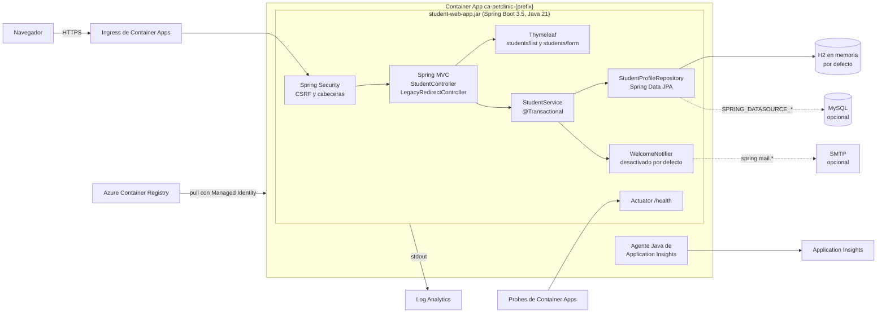
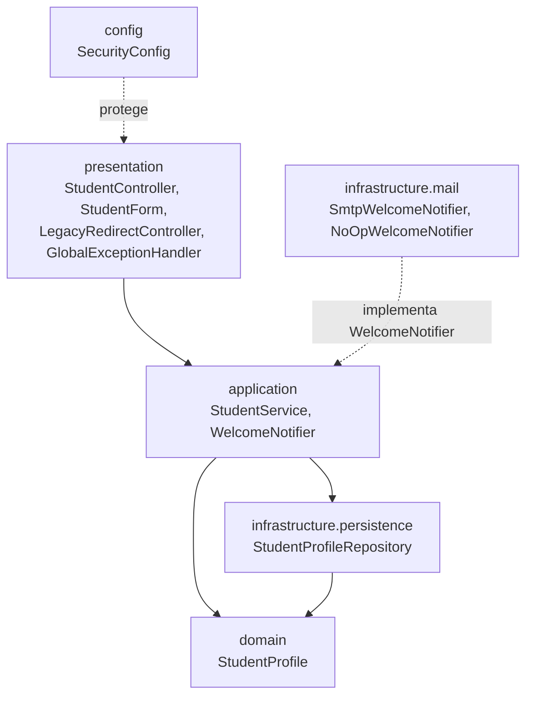

# Arquitectura target: student-web-app

> **Fase 2 (planning)** · 2026-10-04 · Siguiente fase: `@spring-legacy-migration`

## Resumen
- La aplicación Java EE + Spring 5.3 que hoy corre en Open Liberty se migra a **Spring Boot 3.5.16 con Java 21**. Se empaqueta como **JAR ejecutable** en `src/student-web-app/` y se despliega en **Azure Container Apps**.
- La estrategia es **híbrida**: un proyecto nuevo que parte de una copia del código legacy. `legacy/` no se modifica.
- Se conserva la funcionalidad: consultar y dar de alta perfiles de estudiantes y enviar el email de bienvenida.
- Los dos flujos duplicados se unifican en uno y se refuerza la seguridad.

## Stack target

| Capa | Legacy | Target | ADR |
| --- | --- | --- | --- |
| Lenguaje y runtime | Java 11 (Java 17 OpenJ9 en ejecución) | Java 21 (Eclipse Temurin) | [ADR-001](adr/ADR-001-stack-target.md) |
| Framework | Spring Framework 5.3.23 y servlets Java EE 8 | Spring Boot 3.5.16 (Spring Framework 6.2, Jakarta EE 10) | [ADR-001](adr/ADR-001-stack-target.md) |
| Namespace | `javax.*` | `jakarta.*`, migrado con OpenRewrite | [ADR-003](adr/ADR-003-namespace-jakarta.md) |
| Build y empaquetado | Ant, JARs vendorizados, WAR | Maven Wrapper, JAR ejecutable | [ADR-004](adr/ADR-004-build-empaquetado.md) |
| Servidor | Open Liberty 25.0.0.7 | Tomcat embebido | [ADR-004](adr/ADR-004-build-empaquetado.md) |
| Capa web | 3 servlets y 2 controllers | Un único `StudentController` más redirecciones para las URLs legacy | [ADR-007](adr/ADR-007-capa-web.md) |
| Vistas | 4 JSP con scriptlets | 2 plantillas Thymeleaf y una página de error | [ADR-008](adr/ADR-008-frontend.md) |
| Persistencia | iBATIS 2.3.0 con transacciones manuales | Spring Data JPA (Hibernate 6.6) con `@Transactional` | [ADR-006](adr/ADR-006-persistencia.md) |
| Base de datos | MySQL 8.0 por JNDI, DDL con `DROP` | H2 (modo MySQL) por defecto y MySQL opcional, con Flyway | [ADR-005](adr/ADR-005-base-de-datos.md) |
| Seguridad | Ninguna | Spring Security (CSRF y cabeceras) y validación, sin login | [ADR-009](adr/ADR-009-seguridad.md) |
| Email | JavaMail por JNDI, solo en uno de los flujos | `JavaMailSender`, desactivado por defecto, en todas las altas | [ADR-011](adr/ADR-011-notificacion-email.md) |
| Configuración | `server.xml` y `server.env` de Liberty, con secretos en archivos | `application.yml`, variables de entorno y secretos de Container Apps | [ADR-010](adr/ADR-010-configuracion-observabilidad.md) |
| Logging | log4j 1.2.17 a consola y archivo | SLF4J y Logback a stdout | [ADR-010](adr/ADR-010-configuracion-observabilidad.md) |
| Observabilidad | — | Actuator (`/health`) y agente de Application Insights | [ADR-010](adr/ADR-010-configuracion-observabilidad.md) |
| Tests | Ninguno | JUnit 5, MockMvc y `@DataJpaTest` | [ADR-012](adr/ADR-012-pruebas.md) |
| Contenedor | Liberty en una sola etapa, puertos 9080 y 9443 | Multi-stage sobre `eclipse-temurin:21-jre-alpine`, puerto 8080, uid 1001 | [ADR-004](adr/ADR-004-build-empaquetado.md) |
| Despliegue | Local, con docker-compose | `ca-petclinic-{prefix}` en Azure Container Apps | [ADR-013](adr/ADR-013-cutover.md) |

## Vista de despliegue



## Capas



Reglas:
- `presentation` solo habla con `application`.
- Solo `StudentService` usa el repositorio.
- `WelcomeNotifier` es una interfaz de `application`; sus implementaciones están en `infrastructure.mail`.

## Estructura del proyecto

```
src/student-web-app/
├── pom.xml
├── mvnw, mvnw.cmd, .mvn/wrapper/
├── Dockerfile
├── .dockerignore
└── src/
    ├── main/
    │   ├── java/org/sample/azure/student/
    │   │   ├── StudentWebApplication.java
    │   │   ├── config/                     SecurityConfig
    │   │   ├── domain/                     StudentProfile
    │   │   ├── application/                StudentService, WelcomeNotifier
    │   │   ├── infrastructure/
    │   │   │   ├── persistence/            StudentProfileRepository
    │   │   │   └── mail/                   SmtpWelcomeNotifier, NoOpWelcomeNotifier
    │   │   └── presentation/               StudentController, StudentForm,
    │   │                                   LegacyRedirectController, GlobalExceptionHandler
    │   └── resources/
    │       ├── application.yml
    │       ├── application-prod.yml
    │       ├── db/migration/V1__create_student_profiles.sql
    │       ├── templates/                  students/list.html, students/form.html,
    │       │                               error.html, fragments/layout.html
    │       └── static/css/site.css
    └── test/java/org/sample/azure/student/ ...
```

## Correspondencia entre legacy y target

| Componente legacy | Componente target | Notas |
| --- | --- | --- |
| `@Controller` de Spring 5.3 (`StudentController`, `AddStudentController`) | `presentation.StudentController` con `@RequestMapping("/app")` | Inyección por constructor |
| Servlets `IndexServlet`, `AddStudentServlet` y `StudentProfileListServlet` | `LegacyRedirectController` (302) | [ADR-007](adr/ADR-007-capa-web.md) |
| `@Service StudentService` | `application.StudentService` con `@Transactional` | [ADR-006](adr/ADR-006-persistencia.md) |
| `MyBatisUtil` y los SqlMap XML de iBATIS 2 | `StudentProfileRepository` (Spring Data JPA) y `@Entity` | [ADR-006](adr/ADR-006-persistencia.md) |
| `web.xml` (`DispatcherServlet` y listener) | Autoconfiguración de Spring Boot | [ADR-007](adr/ADR-007-capa-web.md) |
| `applicationContext.xml` (`component-scan`) | Escaneo de componentes desde `StudentWebApplication` | — |
| `spring-servlet.xml` (`mvc:annotation-driven`, `InternalResourceViewResolver`) | `WebMvcAutoConfiguration` y Thymeleaf | [ADR-008](adr/ADR-008-frontend.md) |
| `applicationContext-service.xml` | Se elimina (estaba huérfano) | — |
| JNDI `jdbc/StudentDB` | `spring.datasource.*` | [ADR-005](adr/ADR-005-base-de-datos.md) |
| JNDI `mail/StudentMailSession` | `spring.mail.*` y `JavaMailSender` | [ADR-011](adr/ADR-011-notificacion-email.md) |
| JSP con scriptlets | Thymeleaf | [ADR-008](adr/ADR-008-frontend.md) |
| `CommonHttpServletFilter` (no registrado) | `server.forward-headers-strategy=native` | [ADR-009](adr/ADR-009-seguridad.md) |
| log4j 1.2.17 y `log4j.properties` | SLF4J y Logback a stdout | [ADR-010](adr/ADR-010-configuracion-observabilidad.md) |
| Jackson 1.x | Desaparece; no hay JSON en el target | [ADR-007](adr/ADR-007-capa-web.md) |
| Imports `javax.*` | `jakarta.*`, con OpenRewrite | [ADR-003](adr/ADR-003-namespace-jakarta.md) |
| `database/create_table.sql` | Migración Flyway `V1__create_student_profiles.sql`, sin `DROP` | [ADR-005](adr/ADR-005-base-de-datos.md) |
| Ant, WAR y Open Liberty | Maven, JAR y Tomcat embebido | [ADR-004](adr/ADR-004-build-empaquetado.md) |
| Dockerfile de Liberty | Dockerfile multi-stage sobre Temurin 21 | [ADR-004](adr/ADR-004-build-empaquetado.md) |

## Restricciones no funcionales
Vienen de `.github/copilot-instructions.md` y de la infraestructura del taller:
- Puerto 8080 y `/health` en 200 sin ninguna variable de entorno obligatoria.
- Imagen multi-stage sobre `eclipse-temurin:21-jre-alpine`, ejecutada con un usuario no root.
- Sin secretos en el código, en la configuración ni en la imagen. Sin `localhost` en la configuración para Azure.
- Solo el namespace `jakarta.*`. El JAR es ejecutable, no un WAR.
- Tiene que compilar a la primera en un Codespace limpio, usando el Maven Wrapper con `JAVA_HOME_21`.
- La imagen se descarga del ACR con la Managed Identity que ya existe en `infra/main.bicep`.

## Índice de decisiones

| ADR | Decisión |
| --- | --- |
| [ADR-001](adr/ADR-001-stack-target.md) | Spring Boot 3.5.16 con Java 21 (Temurin) |
| [ADR-002](adr/ADR-002-estrategia-migracion.md) | Estrategia híbrida: proyecto nuevo en `src/student-web-app/` a partir del código legacy |
| [ADR-003](adr/ADR-003-namespace-jakarta.md) | OpenRewrite (`JavaxMigrationToJakarta` y `Log4j1ToSlf4j1`) como primer paso |
| [ADR-004](adr/ADR-004-build-empaquetado.md) | Maven, JAR ejecutable, Tomcat embebido y Dockerfile multi-stage |
| [ADR-005](adr/ADR-005-base-de-datos.md) | H2 (modo MySQL) por defecto, MySQL mediante variables de entorno, y Flyway |
| [ADR-006](adr/ADR-006-persistencia.md) | Spring Data JPA con anotaciones en lugar de iBATIS 2 |
| [ADR-007](adr/ADR-007-capa-web.md) | Un único conjunto de controllers Spring MVC; las URLs legacy redirigen |
| [ADR-008](adr/ADR-008-frontend.md) | Thymeleaf en lugar de JSP |
| [ADR-009](adr/ADR-009-seguridad.md) | Sin login, con CSRF, validación, cabeceras de seguridad y logs sin datos personales |
| [ADR-010](adr/ADR-010-configuracion-observabilidad.md) | `application.yml` con variables de entorno, logs a stdout, `/health` y Application Insights |
| [ADR-011](adr/ADR-011-notificacion-email.md) | `JavaMailSender`, desactivado por defecto, en todas las altas |
| [ADR-012](adr/ADR-012-pruebas.md) | JUnit 5, MockMvc y `@DataJpaTest`, con un test por criterio de aceptación |
| [ADR-013](adr/ADR-013-cutover.md) | Cambio directo con revisiones de Container Apps; rollback mediante una etiqueta inmutable |

El alcance, el contrato de URLs y los criterios de aceptación están en [MIGRATION-SCOPE.md](MIGRATION-SCOPE.md). El orden de ejecución está en [migration-plan.md](migration-plan.md) y los riesgos en [risks.md](risks.md).
