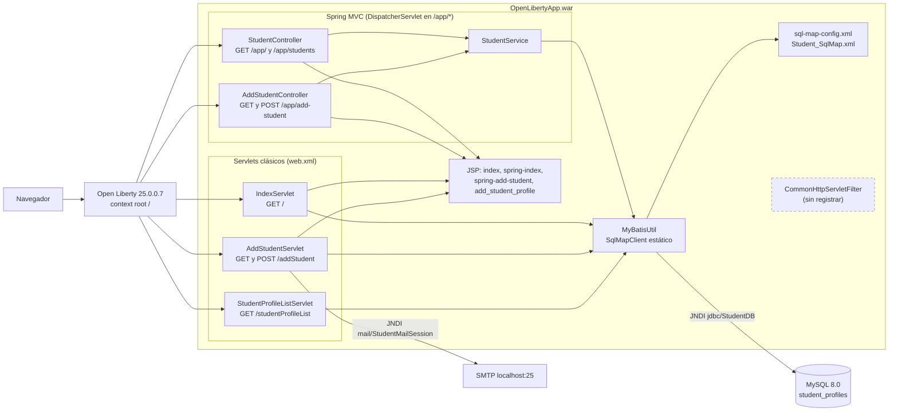
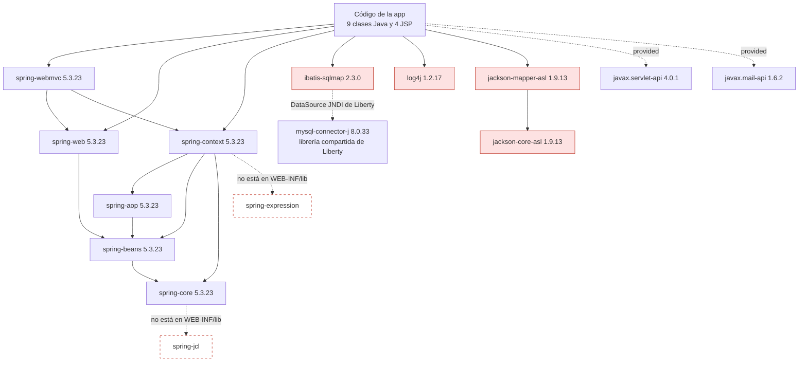

# Grafo de dependencias: student-web-app

> **Sistema analizado:** `legacy/java/jakarta-ee/student-web-app` · **Fase 1 (assessment)** · 2026-10-04

## 1. Componentes en runtime

Lo que muestra el grafo:
- Los 3 servlets clásicos **se saltan `StudentService`** y van directamente a `MyBatisUtil`.
- Solo `AddStudentServlet` usa el correo.
- `MyBatisUtil` es el único punto de acceso a la BD, pero es estático y no lo gestiona Spring.

## 2. Librerías

Leyenda: en rojo, las librerías EOL o retiradas; en borde discontinuo, las dependencias transitivas obligatorias que faltan (ver [inventory/dependencies-pom.md](inventory/dependencies-pom.md)).

## 3. Dependencias por clase

| Clase | Clases internas que usa | Librerías y APIs externas |
| --- | --- | --- |
| `controller.StudentController` | `StudentService`, `StudentProfile` | spring-context, spring-beans, spring-web, spring-webmvc, log4j |
| `controller.AddStudentController` | `StudentService` | spring-context, spring-beans, spring-web, spring-webmvc, log4j |
| `service.StudentService` | `MyBatisUtil`, `StudentProfile` | spring-context, iBATIS, log4j |
| `IndexServlet` | `MyBatisUtil`, `StudentProfile` | `javax.servlet`, iBATIS, log4j |
| `AddStudentServlet` | `MyBatisUtil` | `javax.servlet`, `javax.mail`, `javax.naming` (JNDI), iBATIS, log4j |
| `StudentProfileListServlet` | `MyBatisUtil`, `StudentProfile` | `javax.servlet`, iBATIS, Jackson 1.x, log4j |
| `util.MyBatisUtil` | — | iBATIS (`sql-map-config.xml`) |
| `filter.CommonHttpServletFilter` | — | `javax.servlet` |
| `StudentProfile` | — | — |

## 4. Dependencias del servidor (Open Liberty)

| Recurso | Lo define | Lo consume | Qué cambia sin Liberty |
| --- | --- | --- | --- |
| DataSource `jdbc/StudentDB` | `server-docker.xml` L35-L41 | `sql-map-config.xml` (iBATIS) | No hay JNDI: hay que configurar la conexión en la app |
| Mail session `mail/StudentMailSession` | `server-docker.xml` L22-L27 | `AddStudentServlet` (`java:comp/env`) | No hay JNDI: hay que configurar el correo en la app |
| Librería compartida `mysql-lib` | `server-docker.xml` L31-L33 y `Dockerfile` L14 | Driver JDBC | Pasa a ser una dependencia del build |
| Context root `/` | `server-docker.xml` L43 | Enlaces absolutos en las JSP | Hay que mantener `/` o actualizar los enlaces |
| Features Java EE 8 | `server-docker.xml` L3-L13 | Servlet 4.0, JSP 2.3, JavaMail 1.6 | Los sustituyen el contenedor embebido y las librerías |
