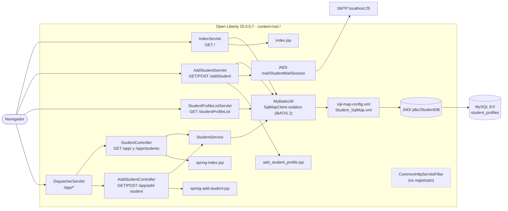
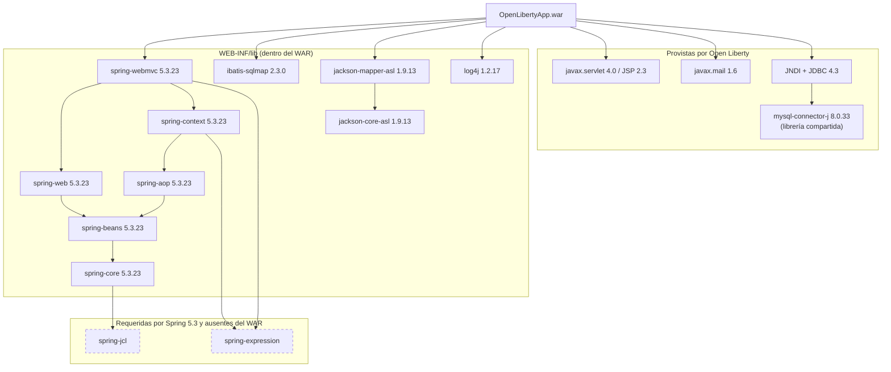

# Grafo de dependencias — Student Web App

Ruta base: `legacy/java/jakarta-ee/student-web-app/`

## 1. Componentes y flujo de llamadas

**Lectura del grafo:**

- Hay dos pilas paralelas: servlets (sin Spring) y Spring MVC. Solo Spring MVC pasa por `StudentService`.
- Todos los caminos convergen en `MyBatisUtil`, que guarda estado estático: acoplamiento fuerte y sin inyección de dependencias.
- Solo `AddStudentServlet` depende del servidor de correo.

## 2. Librerías y runtime

Ver [blockers.md#b-02](blockers.md#b-02) sobre los JARs ausentes.

## 3. Matriz clase × dependencia

| Clase | Spring | iBATIS | log4j 1 | Jackson 1 | `javax.servlet` | `javax.mail` | JNDI |
| --- | :-: | :-: | :-: | :-: | :-: | :-: | :-: |
| `IndexServlet` | | ✔ | ✔ | | ✔ | | |
| `AddStudentServlet` | | ✔ | ✔ | | ✔ | ✔ | ✔ |
| `StudentProfileListServlet` | | ✔ | ✔ | ✔ | ✔ | | |
| `CommonHttpServletFilter` | | | | | ✔ | | |
| `StudentController` | ✔ | | ✔ | | | | |
| `AddStudentController` | ✔ | | ✔ | | | | |
| `StudentService` | ✔ | ✔ | ✔ | | | | |
| `MyBatisUtil` | | ✔ | | | | | ✔ (vía iBATIS) |
| `StudentProfile` | | | | | | | |

## 4. Dependencias externas en tiempo de ejecución

| Dependencia | Cómo se obtiene | La usa |
| --- | --- | --- |
| MySQL `studentdb` | JNDI `jdbc/StudentDB` (Liberty) | F-01, F-02 |
| Servidor SMTP | JNDI `mail/StudentMailSession` (Liberty) | F-03 |
| Sistema de archivos `/logs/applog/...` | `RollingFileAppender` de log4j | Logging |
