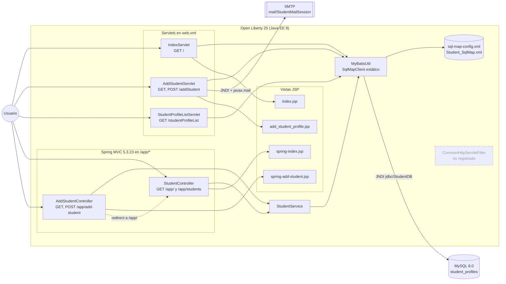
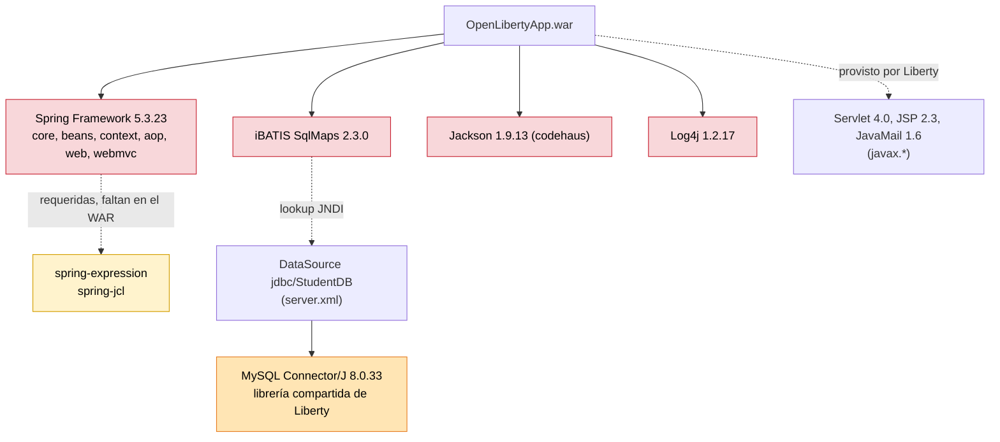
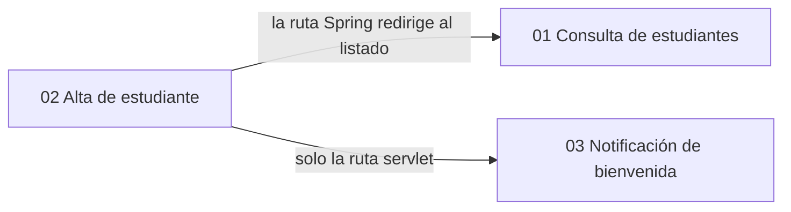

# Grafo de dependencias: student-web-app

> Sistema: `legacy/java/jakarta-ee/student-web-app/`

## Componentes en runtime

**Lectura:** las dos pilas web (servlets y Spring MVC) llegan al mismo punto de acceso a datos estático (`MyBatisUtil`). Solo la pila Spring pasa por `StudentService`, y solo `AddStudentServlet` usa SMTP.

## Librerías y plataforma

Leyenda: rojo = sin soporte (EOL o sin parches OSS). Amarillo = riesgo pendiente de validar. Naranja = versión con CVE.

## Dependencias entre features

## Matriz componente → recurso

| Componente | MySQL | SMTP | Jackson 1.x | Log4j 1.x | Spring |
| --- | --- | --- | --- | --- | --- |
| IndexServlet | ✔ (directo) | | | ✔ | |
| AddStudentServlet | ✔ (directo) | ✔ | | ✔ | |
| StudentProfileListServlet | ✔ (directo) | | ✔ | ✔ | |
| StudentController | ✔ (vía service) | | | ✔ | ✔ |
| AddStudentController | ✔ (vía service) | | | ✔ | ✔ |
| StudentService | ✔ | | | ✔ | ✔ |
| MyBatisUtil | ✔ | | | (usa `System.out`) | |
| CommonHttpServletFilter | | | | | |

## Configuración externa que consume la app

| Recurso | Dónde se define | Cómo lo consume la app |
| --- | --- | --- |
| `jdbc/StudentDB` | `liberty_config/server-docker.xml:35-41`, con las variables `JDBC_URL`, `DB_USER` y `DB_PASSWORD` | iBATIS por JNDI (`sql-map-config.xml:9-10`) |
| `mail/StudentMailSession` | `liberty_config/server-docker.xml:22-27` | `InitialContext.lookup` (`AddStudentServlet.java:98-99`) |
| Driver MySQL | `liberty_config/server-docker.xml:31-33` y `Dockerfile:14` | Librería compartida del servidor |
| Ruta del log | `resources/log4j.properties:11` | Log4j `RollingFileAppender` |
