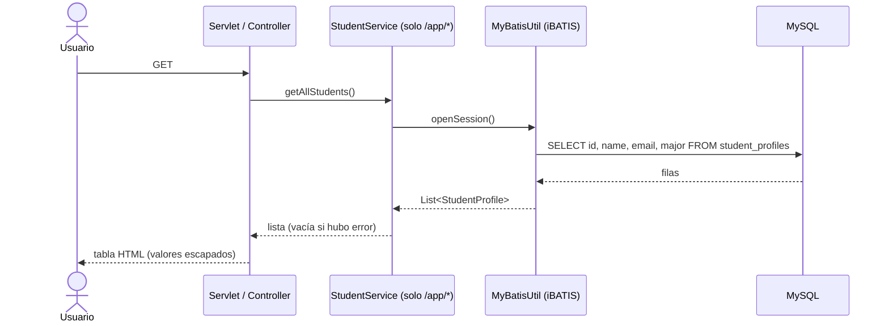

# F-01 · Listado de perfiles de estudiantes

| Campo | Valor |
| --- | --- |
| ID | F-01 |
| Prioridad sugerida | Alta (núcleo del sistema) |
| Complejidad de migración | Baja |
| Actores | Cualquier usuario (sin autenticación) |
| Datos | Tabla `student_profiles` (lectura) |

## Descripción

Muestra todos los perfiles de estudiantes registrados (ID, nombre, email y carrera) en una tabla HTML.

## Puntos de entrada

| URL | Handler | Vista | Pasa por el service |
| --- | --- | --- | --- |
| GET `/` (y cualquier URL no mapeada) | `IndexServlet.doGet` | `index.jsp` | No |
| GET `/studentProfileList` | `StudentProfileListServlet.doGet` | HTML generado en Java + JSON | No |
| GET `/app/` | `StudentController.index` | `spring-index.jsp` | Sí |
| GET `/app/students` | `StudentController.listStudents` | `spring-index.jsp` | Sí |

## Flujo

Los servlets omiten `StudentService` y llaman a `MyBatisUtil` directamente.

## Capas

- **Presentación:** `IndexServlet`, `StudentProfileListServlet`, `StudentController`; vistas `index.jsp`, `spring-index.jsp`.
- **Servicio:** `StudentService.getAllStudents()`, solo en el camino Spring.
- **Datos:** statement `com.azure.sample.StudentMapper.listStudent` en `Student_SqlMap.xml`.

## Comportamiento observado (caracterización)

| Escenario | `/` | `/studentProfileList` | `/app/`, `/app/students` |
| --- | --- | --- | --- |
| Hay estudiantes | Tabla de 4 columnas | Tabla de 4 columnas + JSON de la lista como texto escapado | Tabla de 4 columnas |
| Tabla vacía | "No student profiles found." | Solo los encabezados de la tabla | "No student profiles found." |
| Error de BD | Caja de error con el mensaje de la excepción + "Loading student data..." | HTML parcial con el mensaje de error y luego HTTP 500 | "No student profiles found." (el service traga el error) |
| Mensajes flash tras un alta | — | — | Muestra `successMessage` / `errorMessage` |

- Orden de las filas: no definido (no hay `ORDER BY`).
- Sin paginación ni filtros.
- Todos los valores se escapan en HTML (`esc()` / `escapeHtml()`).
- El JSON de `/studentProfileList` tiene la forma `[{"id":1,"name":"...","email":"...","major":"..."}]` (serialización por getters con Jackson 1).

## Hallazgos

- Lógica implementada 3 veces y endpoints duplicados (`/app/` = `/app/students`).
- Exposición de PII (emails) a usuarios anónimos.
- Manejo de errores inconsistente entre caminos, con divulgación del mensaje de la excepción en `/` (CWE-209).
- Resultado sin límite: no escala si la tabla crece.

## Decisiones abiertas para la Fase 2

- ¿Qué URLs se conservan? ¿Se redirigen las legacy (`/`, `/studentProfileList`) al camino nuevo?
- ¿El JSON de `/studentProfileList` es un contrato que algún consumidor usa, o es solo una demo?
- ¿Se agrega orden y paginación?
- ¿Se requiere autenticación para ver PII?

## Criterios de aceptación propuestos (a validar)

- [ ] El listado muestra todos los registros de `student_profiles` con ID, Name, Email y Major.
- [ ] Todos los valores se muestran escapados (sin XSS).
- [ ] Con la tabla vacía se muestra un mensaje de estado vacío.
- [ ] Ante un error de BD se muestra un mensaje genérico (sin detalle técnico) y se registra el detalle en los logs.
