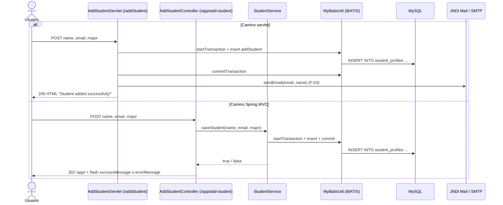

# F-02 · Alta de perfil de estudiante

| Campo | Valor |
| --- | --- |
| ID | F-02 |
| Prioridad sugerida | Alta (núcleo del sistema) |
| Complejidad de migración | Baja-media (por la divergencia entre caminos) |
| Actores | Cualquier usuario (sin autenticación) |
| Datos | Tabla `student_profiles` (escritura) |
| Dependencias | [F-03 Email de bienvenida](03-email-bienvenida.md) (solo en el camino servlet) |

## Descripción

Registra un nuevo estudiante con nombre, email y carrera mediante un formulario HTML.

## Puntos de entrada

| URL | Handler | Vista / respuesta |
| --- | --- | --- |
| GET `/addStudent` | `AddStudentServlet.doGet` | `add_student_profile.jsp` |
| POST `/addStudent` | `AddStudentServlet.doPost` | HTML inline (éxito) o forward a `add_student_profile.jsp` (error) |
| GET `/app/add-student` | `AddStudentController.showAddStudentForm` | `spring-add-student.jsp` |
| POST `/app/add-student` | `AddStudentController.addStudent` | `redirect:/app/` con flash attributes (patrón PRG) |

## Entradas

| Campo | Cliente (HTML5) | Servidor: servlet | Servidor: Spring |
| --- | --- | --- | --- |
| `name` | `required` | Sin validación (si falta, se inserta `NULL`) | Obligatorio (`@RequestParam`, HTTP 400 si falta) |
| `email` | `required`, `type="email"` | Sin validación | Obligatorio, sin validar el formato |
| `major` | `required` | Sin validación | Obligatorio |

## Flujo

## Capas

- **Presentación:** `AddStudentServlet`, `AddStudentController`; vistas `add_student_profile.jsp`, `spring-add-student.jsp`.
- **Servicio:** `StudentService.saveStudent()`, solo en el camino Spring.
- **Datos:** statement `com.azure.sample.StudentMapper.addStudent`, con transacción manual de iBATIS.

## Comportamiento observado (caracterización)

| Escenario | Servlet `/addStudent` | Spring `/app/add-student` |
| --- | --- | --- |
| Alta exitosa | HTML inline con links a `studentProfileList` y a `/` ("Add Another Student" lleva al listado, no al formulario) | Redirect a `/app/` con "Student {name} has been added successfully!" |
| Alta exitosa pero el email falla | Se loguea "Error adding student", el registro **queda persistido** y se muestra la página de éxito | No aplica (no envía email) |
| Error de BD | Forward al formulario con el atributo `errorMsg`, pero la JSP lee `errorMessage`: **el usuario no ve el error** | Redirect a `/app/` con "Failed to save student. Please try again." |
| Email duplicado | Se acepta (no hay `UNIQUE`) | Se acepta |
| Campo > 255 caracteres | Error de BD (`STRICT_TRANS_TABLES` por defecto en MySQL 8) | Ídem |

- El id generado no se devuelve al usuario.
- No hay idempotencia: si se reenvía el formulario del servlet, se crea un duplicado (el camino Spring lo mitiga con PRG).

## Hallazgos

- **Divergencia funcional:** solo el camino servlet envía el email de bienvenida.
- Bug de atributo `errorMsg` / `errorMessage` (`AddStudentServlet.java:90`).
- Sin protección CSRF y sin autenticación.
- PII registrada en los logs a nivel INFO (nombre y email).
- Salida sin escapar en ambas JSP de formulario (XSS latente).
- Validación solo del lado del cliente.

## Decisiones abiertas para la Fase 2

- ¿Cuál es el comportamiento oficial: con o sin email de bienvenida?
- ¿Se requiere unicidad de email?
- ¿Qué validaciones de servidor hacen falta (formato de email, longitudes, campos obligatorios)?
- ¿Se conservan las URLs `/addStudent` o se redirigen?

## Criterios de aceptación propuestos (a validar)

- [ ] Un alta válida persiste un registro en `student_profiles` y muestra un mensaje de éxito.
- [ ] Una entrada inválida se rechaza en el servidor con mensajes por campo.
- [ ] Ante un error de BD, el usuario ve un mensaje genérico y no se persiste nada.
- [ ] El formulario incluye un token CSRF.
- [ ] Después del alta se aplica Post/Redirect/Get (sin duplicados al recargar).
