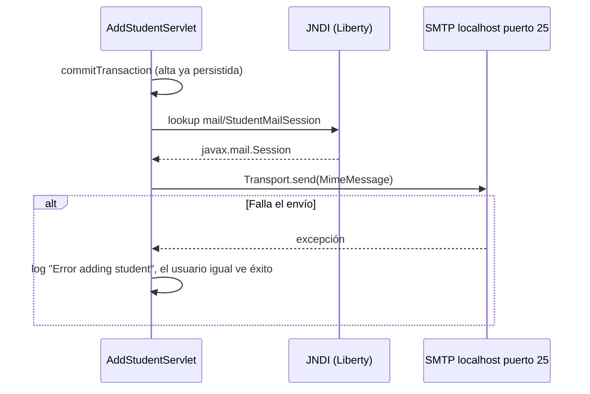

# F-03 · Email de bienvenida

| Campo | Valor |
| --- | --- |
| ID | F-03 |
| Prioridad sugerida | Media (a confirmar si es requisito de negocio) |
| Complejidad de migración | Media (integración externa y configuración de Azure) |
| Disparador | Alta exitosa por POST `/addStudent` (solo el camino servlet) |
| Integración | JavaMail 1.6 vía JNDI `java:comp/env/mail/StudentMailSession` |

## Descripción

Después de registrar un estudiante, el sistema le envía un email de bienvenida a la dirección ingresada en el formulario.

## Implementación actual

| Aspecto | Valor |
| --- | --- |
| Código | `AddStudentServlet.sendEmail(String to, String name)` (`AddStudentServlet.java:95-106`) |
| Obtención de la sesión | `new InitialContext().lookup("java:comp/env/mail/StudentMailSession")` |
| Configuración | `liberty_config/server-docker.xml:22-27`: `host="localhost"`, `port="25"`, `transportProtocol="smtp"`, `from="noreply@example.com"`, `user="user"`, `password="changeit"`, `mailSessionID="SendGridMailSession"` |
| Destinatario | `InternetAddress.parse(to, false)` con el email del formulario (parseo no estricto) |
| Asunto | `"Welcome, " + name + "!"` |
| Cuerpo (texto plano) | `"Dear {name},\n\nYour student profile has been created successfully.\n\nRegards,\nAdmin"` |
| Ejecución | Síncrona, dentro del request y después del commit |

## Flujo

## Comportamiento observado (caracterización)

- Se envía **solo** desde `/addStudent`; el alta por `/app/add-student` no envía email.
- Si el envío falla, el alta no se revierte y el usuario no se entera.
- No hay reintentos, cola, plantilla ni internacionalización.
- Se loguean el destinatario y el resultado a nivel INFO (`AddStudentServlet.java:58,96,105`).

## Hallazgos

| Hallazgo | Riesgo |
| --- | --- |
| Credenciales SMTP en texto plano en `server-docker.xml` | Exposición de secretos |
| SMTP en `localhost:25` | No funciona en Azure Container Apps; la salida por el puerto 25 está bloqueada en la mayoría de suscripciones de Azure |
| Envía a cualquier dirección sin autenticación | Abuso como relay de spam y daño a la reputación del dominio remitente |
| Dependencia de JNDI | Spring Boot embebido no lo provee |
| `javax.mail` | Namespace change a `jakarta.mail` |
| Envío síncrono | Aumenta la latencia del alta y acopla la disponibilidad del SMTP al request |

## Opciones para el target (decidir en Fase 2)

| Opción | Notas |
| --- | --- |
| `JavaMailSender` (`spring-boot-starter-mail`) + SMTP de Azure Communication Services | Cambio mínimo de código; credenciales en Key Vault o secretos de ACA |
| `JavaMailSender` + SendGrid (SMTP o API) | `mailSessionID="SendGridMailSession"` sugiere que ya se usó |
| SDK de Azure Communication Services Email | Autenticación con Managed Identity, sin secretos SMTP |
| Envío asíncrono (`@Async`, o una cola como Service Bus) | Desacopla la disponibilidad; cambia la semántica, así que hay que validarlo con negocio |

## Decisiones abiertas para la Fase 2

- ¿El email es un requisito de negocio? Si lo es, ¿debe dispararse en **todos** los caminos de alta?
- ¿Proveedor y dominio remitente?
- ¿Envío síncrono o asíncrono? ¿Qué pasa si falla?
- ¿Hace falta verificar el email antes de enviar (double opt-in) para evitar abuso?

## Criterios de aceptación propuestos (a validar)

- [ ] Tras un alta exitosa se envía un email con el asunto y cuerpo actuales (o los que defina negocio).
- [ ] Un fallo de email no revierte el alta y queda registrado sin exponer PII completa.
- [ ] No hay credenciales en archivos versionados.
- [ ] El destino y el proveedor se configuran por variables de entorno o secretos.
