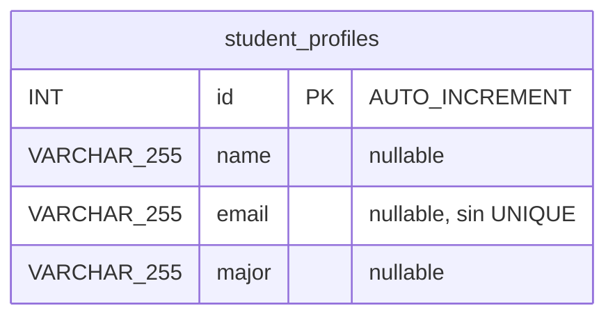

# Inventario de persistencia

Ruta base: `legacy/java/jakarta-ee/student-web-app/`

## Resumen

| Tecnología | Versión | Estado |
| --- | --- | --- |
| iBATIS SQL Maps (`com.ibatis:ibatis-sqlmap`) | 2.3.0 | **EOL**: Apache iBATIS se retiró en 2010 y lo reemplazó MyBatis 3. Spring eliminó su integración en 4.0 |
| MyBatis 3 | — | No se usa. El nombre `MyBatisUtil` y la documentación del sample son engañosos |
| Hibernate / JPA | — | No se usa (no hay `@Entity`, `persistence.xml` ni `*.hbm.xml`) |
| `JdbcTemplate` | — | No se usa |
| DataSource | JNDI `jdbc/StudentDB` definido en Liberty, pool de 2 a 10 | Lo resuelve iBATIS, no Spring |
| Driver | MySQL Connector/J 8.0.33 | Librería compartida del servidor (fuera del WAR) |
| Motor | MySQL 8.0 (`docker-compose.yml`) | EOL desde abril de 2026 |

## sql-map-config.xml

**Ruta:** `resources/sql-map-config.xml` · **Líneas:** 15

| Elemento | Valor | Implicación |
| --- | --- | --- |
| `settings useStatementNamespaces` | `true` | Los statements se invocan como `com.azure.sample.StudentMapper.<id>` |
| `transactionManager type` | `JDBC` | Transacciones manuales vía `SqlMapSession` |
| `dataSource type` | `JNDI`, `DataSource=jdbc/StudentDB` | **Requiere JNDI**, que no existe en Spring Boot embebido |
| `sqlMap resource` | `org/sample/azure/student/msfaa/shared/persistence/xml/Student_SqlMap.xml` | 1 archivo de mapeo |

## Student_SqlMap.xml

**Ruta:** `resources/org/sample/azure/student/msfaa/shared/persistence/xml/Student_SqlMap.xml` · **Líneas:** 17
**Tabla mapeada:** `student_profiles` · **Namespace:** `com.azure.sample.StudentMapper` (no coincide con los paquetes Java; los comentarios están en chino)

| Statement | Tipo | SQL | Parámetros | Resultado |
| --- | --- | --- | --- | --- |
| `listStudent` | `select` | `SELECT id, name, email, major FROM student_profiles` | — | `resultClass="org.sample.azure.student.coreft.StudentProfile"` (auto-mapping por nombre de columna) |
| `addStudent` | `insert` | `INSERT INTO student_profiles (name, email, major) VALUES (#name#, #email#, #major#)` | `parameterClass="java.util.Map"` | No devuelve el id generado (sin `selectKey`) |

### Hallazgos

- Los parámetros usan `#param#`, que genera `PreparedStatement` (no hay SQL injection). No hay sustitución `$param$`.
- `listStudent` no tiene `ORDER BY` ni paginación: el orden no está garantizado y el resultado no tiene límite.
- No hay `resultMap`, caché, named queries, procedimientos almacenados ni SQL dinámico.

## Modelo de datos

**DDL:** `database/create_table.sql`

- El script empieza con `DROP TABLE IF EXISTS` (destructivo) y se ejecuta como init de la imagen MySQL en `docker-compose.yml`.
- No hay herramienta de migraciones (Flyway o Liquibase), ni restricciones `NOT NULL`/`UNIQUE`, ni columnas de auditoría.

## Modelo Java: StudentProfile

**Ruta:** `src/org/sample/azure/student/coreft/StudentProfile.java` · **Líneas:** 120

- POJO `Serializable` con `id` (`int`), `name`, `email` y `major`, constructor vacío, getters/setters y `toString()`.
- No tiene anotaciones (ni `javax.persistence` ni `jakarta.persistence`), así que el modelo no se ve afectado por el namespace change.
- `toString()` incluye el email (PII) y se podría filtrar a los logs.

## Patrones Hibernate 3/4 → 6

| Patrón | Ocurrencias |
| --- | --- |
| `org.hibernate.Criteria` legacy | 0 |
| `Session.createSQLQuery()` | 0 |
| `UserType` custom | 0 |
| Filters de Hibernate | 0 |
| `*.hbm.xml` | 0 |

No aplica: el sistema no usa Hibernate.

## Equivalencias para el target

Opciones a decidir en Fase 2:

| Legacy (iBATIS 2) | MyBatis 3 + `mybatis-spring-boot-starter` | Spring Data JPA | Spring `JdbcClient` |
| --- | --- | --- | --- |
| `sqlMapConfig` + DataSource JNDI | `spring.datasource.*` (HikariCP) + `mybatis.mapper-locations` | `spring.datasource.*` + `spring.jpa.*` | `spring.datasource.*` |
| `<select id="listStudent" resultClass=...>` | `@Select` o `<select resultType=...>` en un mapper XML | `StudentRepository.findAll()` | `jdbcClient.sql(...).query(StudentProfile.class).list()` |
| `<insert parameterClass="java.util.Map">` con `#name#` | `#{name}` con un parámetro objeto o `@Param` | `repository.save(entity)` con `@GeneratedValue(strategy = IDENTITY)` | `.param("name", ...).update()` |
| `startTransaction` / `commitTransaction` / `endTransaction` | `@Transactional` | `@Transactional` | `@Transactional` |
| `MyBatisUtil` estático | Interfaz `@Mapper` inyectada | Interfaz `JpaRepository` inyectada | Bean inyectado |
| Cambios al modelo | Ninguno | `@Entity`, `@Table`, `@Id` (`jakarta.persistence`) | Ninguno |
| Esfuerzo estimado | Bajo (traducción casi 1:1 del XML) | Bajo-medio | Bajo |

## Consideraciones para Azure

- Azure Database for MySQL Flexible Server exige TLS: hay que quitar `useSSL=false&allowPublicKeyRetrieval=true` de la URL JDBC.
- Credenciales: hoy se usa usuario y contraseña por variables de entorno con valores versionados. Evaluar autenticación con Microsoft Entra ID y Managed Identity (passwordless).
- El driver pasa de ser una librería compartida del servidor a una dependencia Maven `runtime` (`com.mysql:mysql-connector-j`).
