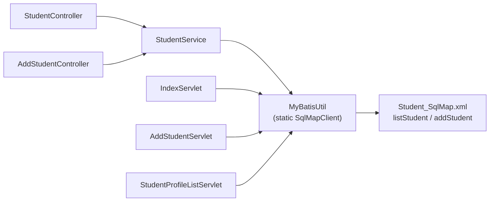

# Inventario: services, repositories y DAOs

> Sistema: `legacy/java/jakarta-ee/student-web-app/`. Las rutas son relativas a esa carpeta.

## Services

| Service | Implementa interface | Métodos públicos | Transaccional | Archivo |
| --- | --- | --- | --- | --- |
| StudentService | No | 2 | Manual, con iBATIS (`startTransaction` / `commitTransaction` / `endTransaction`). Sin `@Transactional` | `src/org/sample/azure/student/coreft/service/StudentService.java` |

### Métodos

| Método | Operación | Statement iBATIS | Manejo de errores | Evidencia |
| --- | --- | --- | --- | --- |
| `List<StudentProfile> getAllStudents()` | Lectura | `com.azure.sample.StudentMapper.listStudent` | Captura cualquier `Exception` y devuelve una lista vacía | `StudentService.java:19`, catch en `:28-31` |
| `boolean saveStudent(String name, String email, String major)` | Escritura | `com.azure.sample.StudentMapper.addStudent` | Captura cualquier `Exception`, llama a `endTransaction()` y devuelve `false` | `StudentService.java:45`, transacción en `:52-62` |

### Observaciones
- Solo lo usan los controllers Spring. Los 3 servlets duplican su lógica llamando a `MyBatisUtil` directamente.
- Obtiene el `SqlMapClient` con una llamada estática (`MyBatisUtil.getSqlMapClient()`), no por inyección. Sin refactor no se puede probar con mocks.
- **`getAllStudents()` oculta los errores de BD.** El `catch` de `StudentController` nunca se ejecuta por un fallo de BD, y la UI muestra "No student profiles found." en lugar de un error.
- Escribe datos personales (nombre, email) en el log con nivel INFO (`:46`, `:64`).
- No valida la entrada: nulos, formato de email ni longitud.

## Repositories / DAOs

| Repository | Tipo | Tecnología | Métodos | Archivo |
| --- | --- | --- | --- | --- |
| *(no existe)* | — | — | — | No hay capa DAO ni Repository. `applicationContext.xml` escanea el paquete `org.sample.azure.student.coreft.dao`, que no existe |
| MyBatisUtil (equivalente funcional) | Clase utilitaria estática (singleton) | iBATIS SqlMaps 2.3.0 (`SqlMapClient`) | 1 (`getSqlMapClient()`) | `src/org/sample/azure/student/coreft/util/MyBatisUtil.java` |

### Observaciones sobre MyBatisUtil
- **Pese al nombre, no es MyBatis.** Usa `com.ibatis.sqlmap.client.SqlMapClient` de iBATIS 2.x.
- Se inicializa en un bloque `static` (`:13-25`). Si falla, guarda la excepción y cada llamada posterior lanza `RuntimeException` (`:27-36`).
- Usa `System.out` / `System.err` en lugar del logger (`:15`, `:18`, `:22`).
- No cierra el `Reader` de `sql-map-config.xml` (`:16`): fuga menor de recurso.
- Vive fuera del contenedor de Spring (no es un bean).

## Patrones problemáticos (checklist)

| Patrón | ¿Presente? | Detalle |
| --- | --- | --- |
| `HibernateTemplate` | No | — |
| `HibernateDaoSupport` / `JdbcDaoSupport` | No | — |
| `SqlMapClientTemplate` / `SqlMapClientDaoSupport` (integración iBATIS de Spring, eliminada en Spring 4.0) | No | iBATIS se usa sin integración con Spring |
| SQL inline en Java | No | El SQL está en `Student_SqlMap.xml` |
| Service o DAO sin interface | Sí | `StudentService` y `MyBatisUtil`. Es migrable, pero dificulta los tests |
| Acceso a datos desde la capa web | **Sí** | `IndexServlet`, `AddStudentServlet` y `StudentProfileListServlet` llaman a `MyBatisUtil` |
| Transacciones manuales | Sí | 2 lugares: `StudentService.saveStudent` y `AddStudentServlet.doPost` (`AddStudentServlet.java:47-55`) |
| Excepciones tragadas | Sí | `StudentService.getAllStudents` y `saveStudent` |

## Mapa de llamadas

Hay 5 consumidores y un único punto de acceso a datos estático. Ese acoplamiento es el principal impedimento para inyectar dependencias y escribir tests.
