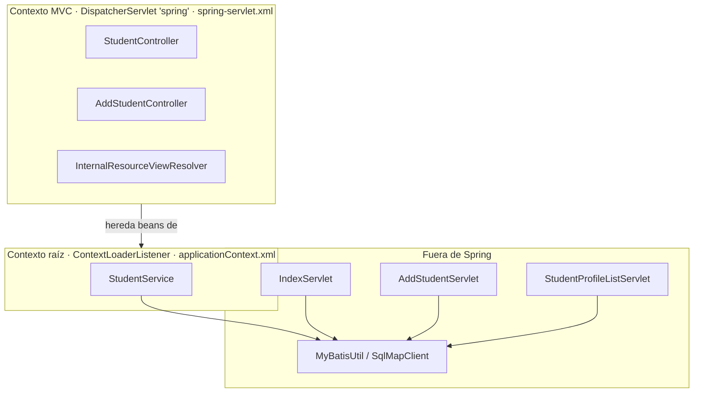

# Inventario de configuración Spring

Ruta base: `legacy/java/jakarta-ee/student-web-app/`

## Resumen

| Archivo | Lo carga | Líneas | `<bean>` | Rol |
| --- | --- | --- | --- | --- |
| `WebContent/WEB-INF/web.xml` | Contenedor (Servlet 4.0) | 78 | — | Arranque: `ContextLoaderListener`, `DispatcherServlet`, 3 servlets, 2 `resource-ref` JNDI |
| `WebContent/WEB-INF/applicationContext.xml` | `ContextLoaderListener` (contexto raíz) | 16 | 0 | `component-scan` de `service` y `dao` |
| `WebContent/WEB-INF/spring-servlet.xml` | `DispatcherServlet` `spring` (contexto hijo) | 28 | 1 | `component-scan` de `controller`, `mvc:annotation-driven`, view resolver JSP, `mvc:default-servlet-handler` |
| `resources/applicationContext-service.xml` | **Nadie** (huérfano) | 16 | 1 | `PropertiesFactoryBean` hacia un archivo inexistente |
| `resources/sql-map-config.xml` | `MyBatisUtil` (iBATIS, fuera de Spring) | 15 | — | Ver [persistence.md](persistence.md) |
| `liberty_config/server-docker.xml` | Open Liberty | 46 | — | Features, DataSource, MailSession y aplicación |

No hay clases `@Configuration`, `<context:property-placeholder>`, profiles, `<tx:annotation-driven>` ni `<aop:aspectj-autoproxy>`.

## Jerarquía de contextos

## applicationContext.xml (contexto raíz)

**Ruta:** `WebContent/WEB-INF/applicationContext.xml` · **Líneas:** 16 · **Beans declarados:** 0

### Estructura

- `<context:component-scan base-package="org.sample.azure.student.coreft.service"/>` detecta `StudentService`.
- `<context:component-scan base-package="org.sample.azure.student.coreft.dao"/>` apunta a un paquete **inexistente** (scan vacío).

### Hallazgos

- No hay `DataSource` ni transaction manager: Spring no gestiona la persistencia ni las transacciones (lo hace iBATIS de forma estática).
- No hay externalización de propiedades.

## spring-servlet.xml (contexto MVC)

**Ruta:** `WebContent/WEB-INF/spring-servlet.xml` · **Líneas:** 28 · **Beans declarados:** 1

### Estructura

- `<context:component-scan base-package="org.sample.azure.student.coreft.controller"/>` detecta `StudentController` y `AddStudentController`.
- `<mvc:annotation-driven/>` registra los handler mappings y adapters por anotaciones. Como no hay Jackson 2 en el classpath, no se registran conversores JSON (Jackson 1 no tiene soporte desde Spring 4.1).
- `<bean class="org.springframework.web.servlet.view.InternalResourceViewResolver">` con `prefix="/"` y `suffix=".jsp"`: vistas en la raíz de `WebContent/`, fuera de `WEB-INF`.
- `<mvc:default-servlet-handler/>` delega los recursos estáticos al servlet por defecto del contenedor (la app no tiene recursos estáticos).

### Hallazgos

- Todos los beans tienen scope `singleton` (default); no hay `prototype`, `session` ni `request`.
- En Spring Boot, todo este XML lo reemplaza la auto-configuración de MVC (más `spring.mvc.view.prefix/suffix` si se mantuviera JSP). No hace falta convertirlo uno a uno a `@Configuration`.

## applicationContext-service.xml (huérfano)

**Ruta:** `resources/applicationContext-service.xml` (se copia al classpath) · **Líneas:** 16 · **Beans declarados:** 1

- `<bean id="schemaNameProperties" class="org.springframework.beans.factory.config.PropertiesFactoryBean">` con `classpath:org/sample/azure/student/coreft/persistence/xml/ucm_schema.properties`.
- Ni `web.xml` ni el código lo cargan, y `ucm_schema.properties` **no existe** en el repo. Si se cargara, el arranque fallaría.
- Parece un resto de un sistema mayor (aparecen nombres como `ucm_schema`, `msfaa` y `osap/coreft1617` en otros archivos).
- **Recomendación:** no migrar (confirmar con el cliente).

## web.xml

**Ruta:** `WebContent/WEB-INF/web.xml` · **Líneas:** 78 · **Versión:** Servlet 4.0 (`http://xmlns.jcp.org/xml/ns/javaee`)

| Elemento | Valor | Comentario |
| --- | --- | --- |
| `context-param contextConfigLocation` | `/WEB-INF/applicationContext.xml` | Contexto raíz |
| `listener` | `ContextLoaderListener` | |
| `servlet spring` | `DispatcherServlet`, `load-on-startup=1`, config `/WEB-INF/spring-servlet.xml` | Mapeado a `/app/*` |
| `servlet IndexServlet` | `/` | Reemplaza al servlet por defecto: captura cualquier URL no mapeada |
| `servlet AddStudentServlet` | `/addStudent` | |
| `servlet StudentProfileListServlet` | `/studentProfileList` | |
| `resource-ref jdbc/StudentDB` | `javax.sql.DataSource` | No se usa: iBATIS busca el nombre global `jdbc/StudentDB` |
| `resource-ref mail/StudentMailSession` | `javax.mail.Session` | Lo usa `AddStudentServlet` (`java:comp/env/...`) |
| `filter` | — | `CommonHttpServletFilter` existe pero no está registrado |
| `security-constraint`, `login-config` | — | Sin seguridad declarativa |
| `welcome-file-list`, `error-page`, `session-config` | — | Defaults del contenedor |

## Ratio anotaciones vs XML

| Tipo | Cantidad | % |
| --- | --- | --- |
| Componentes con estereotipo (`@Service`, `@Controller`) | 3 | 75% |
| Beans `<bean>` en XML activos | 1 | 25% |
| Beans `<bean>` en XML huérfanos | 1 | — |
| Directivas de infraestructura XML (`component-scan` ×3, `mvc:annotation-driven`, `mvc:default-servlet-handler`) | 5 | — |
| Componentes declarados en `web.xml` fuera de Spring (3 servlets + `DispatcherServlet` + listener) | 5 | — |

> El sistema tiene **75% de componentes con anotaciones y 25% con XML**. La conversión del XML de Spring es **mínima**, porque Spring Boot reemplaza todo lo declarado. El trabajo real está en `web.xml` (3 servlets fuera de Spring) y en los recursos JNDI definidos en el servidor.

## Open Liberty: server-docker.xml

**Ruta:** `liberty_config/server-docker.xml` · **Líneas:** 46

### Features

| Feature | Uso en el código | Jakarta EE 10 (si se mantiene Liberty) | Spring Boot |
| --- | --- | --- | --- |
| `servlet-4.0` | Sí | `servlet-6.0` | Tomcat embebido |
| `jsp-2.3` | Sí | `pages-3.1` | Thymeleaf (JSP solo con WAR) |
| `jdbc-4.3` | Sí (DataSource JNDI) | `jdbc-4.3` | HikariCP (`spring.datasource.*`) |
| `jndi-1.0` | Sí | `jndi-1.0` | No aplica |
| `javaMail-1.6` | Sí | `mail-2.1` | `spring-boot-starter-mail` |
| `transportSecurity-1.0` | HTTPS en 9443 | `transportSecurity-1.0` | TLS terminado en el ingress de ACA |
| `webProfile-8.0` | Superconjunto | `webProfile-10.0` | — |
| `jaxws-2.2` | **No** | `xmlWS-4.0` o eliminar | — |
| `appSecurity-3.0` | **No** (sin constraints) | `appSecurity-5.0` o eliminar | Spring Security, si se requiere |
| `springBoot-2.0` | **No** (la app es un WAR) | Eliminar | — |
| `localConnector-1.0` | **No** | Eliminar | — |

### Recursos del servidor

| Recurso | Configuración | Hallazgo |
| --- | --- | --- |
| `httpEndpoint` | `host="*"`, puertos 9080/9443 | El target del taller usa 8080 |
| `mailSession` `mail/StudentMailSession` | `host="localhost"`, `port="25"`, `user="user"`, `password="changeit"`, `from="noreply@example.com"`, `mailSessionID="SendGridMailSession"` | Credenciales en texto plano; `localhost` no es válido en Azure |
| `library mysql-lib` | `${env.MYSQL_LIB_DIR}/*.jar` | Driver fuera del WAR |
| `dataSource jdbc/StudentDB` | `${env.JDBC_URL}`, `${env.DB_USER}`, `${env.DB_PASSWORD}`; pool 2–10 | Buen patrón (variables de entorno), pero con valores por defecto versionados |
| `application` | `context-root="/"`, `delegation="parentLast"` | Los links absolutos de las JSP asumen context-root `/` |
| `logging` | `maxFileSize=100`, `maxFiles=10` | Logs del servidor a archivo |
| `applicationMonitor` | `updateTrigger="mbean"` | Sin uso en contenedor |

### Variables de entorno

| Variable | Definida en | Referenciada en `server-docker.xml` |
| --- | --- | --- |
| `JDBC_URL`, `DB_USER`, `DB_PASSWORD` | `server-docker.env`, `docker-compose.yml` | Sí |
| `MYSQL_LIB_DIR` | `server-docker.env`, `Dockerfile` | Sí |
| `SESSION_COOKIE_NAME`, `CLONE_ID`, `SESSION_TIMEOUT`, `LTPA_SFA_EXPIRATION`, `DEV_LIB_DIR` | `server-docker.env` | No |
| `KEYSTORE_*`, `TRUSTED_KEYSTORE_*`, `LTPA_KEY_*`, `JDBC_DRIVER_CLASS` | `Dockerfile` | No (validar si la imagen base las consume) |
