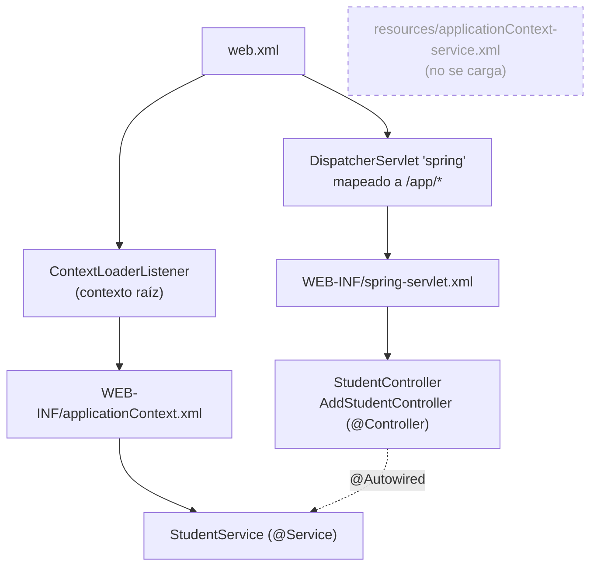

# Inventario: configuración Spring

> Sistema: `legacy/java/jakarta-ee/student-web-app/`. Las rutas de este documento son relativas a esa carpeta.

## Resumen

| Métrica | Valor |
| --- | --- |
| Versión de Spring empaquetada | **5.3.23** (jars en `WebContent/WEB-INF/lib/spring/`). La documentación del proyecto dice 5.3.39 |
| Archivos XML de Spring | 3 (2 activos y 1 huérfano) |
| Beans declarados en XML | 2 (solo 1 activo: `InternalResourceViewResolver`) |
| Componentes con anotaciones | 3 (`@Controller` ×2, `@Service` ×1) |
| Clases `@Configuration` / `@Bean` | 0 |
| Profiles (`<beans profile>` / `@Profile`) | 0 |
| Property placeholders activos | 0 |
| Transacciones declarativas (`<tx:annotation-driven>` / `@Transactional`) | 0 |
| AOP (`<aop:*>` / `@Aspect`) | 0 |
| Spring Security | No |

**Anotaciones vs XML:** 3 de los 4 componentes activos (75 %) usan anotaciones y 1 (25 %) es un bean XML. Si se cuenta el bean huérfano, la proporción es 60 % / 40 %. El resto del XML es infraestructura: escaneo de componentes, MVC y resolución de vistas. **Convertirlo a `@Configuration` requiere poco trabajo.**

## Jerarquía de contextos

## web.xml

**Ruta:** `WebContent/WEB-INF/web.xml` · **Líneas:** 78 · **Esquema:** Java EE 8 (`http://xmlns.jcp.org/xml/ns/javaee`, Servlet 4.0)

### Estructura
- `context-param contextConfigLocation` = `/WEB-INF/applicationContext.xml` (contexto raíz).
- `ContextLoaderListener` (líneas 15-17).
- `DispatcherServlet` `spring` mapeado a `/app/*`, con configuración en `/WEB-INF/spring-servlet.xml` y `load-on-startup=1` (líneas 20-33).
- 3 servlets que no pasan por Spring:
  - `IndexServlet` en `/` (reemplaza al *default servlet*)
  - `AddStudentServlet` en `/addStudent`
  - `StudentProfileListServlet` en `/studentProfileList`
- `resource-ref`:
  - `jdbc/StudentDB` (`javax.sql.DataSource`)
  - `mail/StudentMailSession` (`javax.mail.Session`)
- No define `<filter>`, `<security-constraint>`, `<login-config>`, `<error-page>` ni `<session-config>`.

### Hallazgos
- **`IndexServlet` en `/` sustituye al *default servlet* del contenedor.** Toda URL sin otro mapeo termina en `index.jsp`, por ejemplo `/students` o `/favicon.ico`.
- `CommonHttpServletFilter` existe en el código pero no está registrado: es código muerto (ver [controllers.md](controllers.md)).
- `res-type javax.mail.Session` pasa a `jakarta.mail.Session` en Jakarta EE 9+. `javax.sql.DataSource` es Java SE y no cambia.
- En Spring Boot con JAR ejecutable, `web.xml` deja de usarse. Los 3 servlets y el `DispatcherServlet` tienen que reubicarse (decisión de Fase 2).

## applicationContext.xml (contexto raíz)

**Ruta:** `WebContent/WEB-INF/applicationContext.xml` · **Líneas:** 16 · **Beans declarados:** 0

### Estructura
- `<context:component-scan base-package="org.sample.azure.student.coreft.service"/>` detecta `StudentService`.
- `<context:component-scan base-package="org.sample.azure.student.coreft.dao"/>` apunta a un paquete que **no existe**: no hay capa DAO.
- No declara datasource, transaction manager ni property placeholder.

### Hallazgos
- El DataSource no lo gestiona Spring: lo obtiene iBATIS por JNDI fuera del contenedor de Spring (ver [persistence.md](persistence.md)).

## spring-servlet.xml (contexto web del DispatcherServlet)

**Ruta:** `WebContent/WEB-INF/spring-servlet.xml` · **Líneas:** 28 · **Beans declarados:** 1

### Estructura
- `<context:component-scan base-package="org.sample.azure.student.coreft.controller"/>`
- `<mvc:annotation-driven/>`
- `InternalResourceViewResolver` con `prefix="/"` y `suffix=".jsp"`: las vistas son JSP en la raíz de `WebContent/`.
- `<mvc:default-servlet-handler/>`

### Hallazgos
- No hay `<mvc:resources>`: la app no tiene recursos estáticos propios porque el CSS va embebido en cada JSP.
- El resolver de JSP depende de la decisión sobre vistas (ver [blockers.md](../blockers.md), B1).

## applicationContext-service.xml (huérfano)

**Ruta:** `resources/applicationContext-service.xml` · **Líneas:** 16 · **Beans declarados:** 1

### Estructura
- `PropertiesFactoryBean` `schemaNameProperties` lee `classpath:org/sample/azure/student/coreft/persistence/xml/ucm_schema.properties`.

### Hallazgos
- **Ningún contexto lo carga:** no aparece en `web.xml` ni en otro XML.
- **El archivo `ucm_schema.properties` no existe** en el repositorio. Si alguien cargara este XML, el arranque fallaría.
- En Fase 2 hay que confirmar que no tiene uso y descartarlo.

## Configuración no-Spring relacionada

| Archivo | Rol | Nota |
| --- | --- | --- |
| `resources/sql-map-config.xml` | Configuración de iBATIS 2 | DataSource JNDI `jdbc/StudentDB`. Ver [persistence.md](persistence.md) |
| `resources/org/sample/azure/student/msfaa/shared/persistence/xml/Student_SqlMap.xml` | SQL maps | 2 statements |
| `resources/log4j.properties` | Log4j 1.x | Escribe logs en una ruta absoluta: `/logs/applog/osap/coreft1617/coreft1617sfa.log` |
| `liberty_config/server-docker.xml` | Servidor Open Liberty | DataSource y mail session JNDI, features Java EE 8, `context-root="/"` |
| `liberty_config/server-docker.env` | Variables del servidor | Credenciales de BD en texto plano (ver [blockers.md](../blockers.md), B3) |

## Anotaciones Spring en uso

| Anotación | Ocurrencias | Archivos |
| --- | --- | --- |
| `@Controller` | 2 | `StudentController`, `AddStudentController` |
| `@Service` | 1 | `StudentService` |
| `@Autowired` (inyección por campo) | 2 | Ambos controllers |
| `@GetMapping` | 3 | Ambos controllers |
| `@PostMapping` | 1 | `AddStudentController` |
| `@RequestParam` | 3 | `AddStudentController` |

`@GetMapping`/`@PostMapping` requieren Spring ≥ 4.3, lo que confirma que el código ya usa el estilo moderno de Spring MVC.

## Equivalencias para la conversión a configuración anotada (referencia)

| XML actual | Equivalente anotado |
| --- | --- |
| `ContextLoaderListener` + `DispatcherServlet` en `web.xml` | Auto-configuración de Spring Boot (o `WebApplicationInitializer` si se queda en WAR) |
| `<context:component-scan>` ×3 | `@ComponentScan` / `@SpringBootApplication` |
| `<mvc:annotation-driven/>` | `@EnableWebMvc` o la auto-configuración de Boot |
| `InternalResourceViewResolver` | Propiedades `spring.mvc.view.*` o un `@Bean`. Depende de JSP vs Thymeleaf (B1) |
| `<mvc:default-servlet-handler/>` | `WebMvcConfigurer#configureDefaultServletHandling` |
| `PropertiesFactoryBean` (huérfano) | `@PropertySource` / `@ConfigurationProperties`, solo si se conserva |
