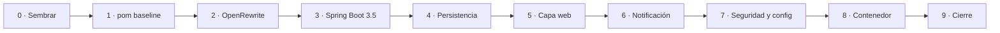

# Plan de migración: Student Web App

> **Fase 2** · Fecha: 2026-10-04 · Estrategia híbrida ([ADR-004](adr/ADR-004-upgrade-vs-greenfield.md)) · Lo ejecuta `@spring-legacy-migration` (Fase 3)
>
> - Alcance y paridad: [MIGRATION-SCOPE.md](MIGRATION-SCOPE.md)
> - Arquitectura: [ARQUITECTURA-TARGET.md](ARQUITECTURA-TARGET.md)
> - Riesgos: [risks.md](risks.md)

## Principios

1. `legacy/` es de solo lectura. Todo el trabajo ocurre en `src/student-web-app/`.
2. Cada paso es un commit y termina con `./mvnw -B verify` en verde. La única excepción son los pasos 2 y 3, que van en un mismo commit ([ADR-003](adr/ADR-003-namespace-strategy.md)).
3. Los tests se escriben en el mismo paso que el código que cubren ([ADR-008](adr/ADR-008-test-strategy.md)).
4. Las versiones las gestiona el BOM de Spring Boot 3.5.16 ([ADR-007](adr/ADR-007-cve-remediation.md)).
5. Registros de la Fase 3:
   - Bitácora: `migration/migration-log.md`.
   - Bloqueos no previstos: `migration/blockers-found.md`.
   - Paridad: `migration/parity-notes.md`, con base en la [matriz de paridad](MIGRATION-SCOPE.md#matriz-de-paridad).

## Orden de los pasos

El lab propone "OpenRewrite → pom.xml → XML config → Hibernate → tests". Ese orden no se puede ejecutar, porque OpenRewrite necesita un build de Maven, y el sistema no tiene Hibernate ni JUnit 4. El orden que sí se puede ejecutar es este:



## Estrategia por módulo

| Módulo legacy | Estrategia | Destino | Paso |
| --- | --- | --- | --- |
| Build Ant (`build.xml`, `build.properties`, `setup-docker.*`) | Reemplazar | `pom.xml`, `mvnw` | 0, 1, 3 |
| Fuentes Java (9 archivos) | Copiar y transformar con OpenRewrite | `src/main/java` | 0, 2 |
| Imports `javax.*` (24) | Migración mecánica | `jakarta.*` | 2 |
| `log4j` 1 en el código | Migración mecánica | SLF4J | 2 |
| Paquete `org.sample.azure.student.coreft` | Renombrar | `org.sample.azure.student` | 3 |
| `StudentProfile` | Migrar y anotar | `domain/StudentProfile` | 4 |
| `MyBatisUtil` y SQL maps | Reemplazar | `repository/StudentProfileRepository` | 4 |
| `StudentService` | Reescribir | `service/StudentService` | 4 |
| `create_table.sql` | Migrar | Flyway `V1__create_student_profiles.sql` | 4 |
| 3 servlets | Eliminar; su comportamiento se reimplementa en los pasos 5 y 6 | — | 4 |
| 2 controllers legacy | Consolidar y reescribir | `web/StudentController`, `web/LegacyRedirectController` | 5 |
| 4 JSP | Reescribir | Thymeleaf + `app.css` | 5 |
| XML de Spring (3) y `web.xml` | Eliminar (se usa la auto-configuración) | — | 4, 5 |
| `CommonHttpServletFilter` | Eliminar | — | 5 |
| Envío de email | Reescribir detrás de un puerto | `notification/*` | 6 |
| Seguridad (hoy no existe) | Nuevo | `config/SecurityConfig`, `web/GlobalExceptionHandler` | 7 |
| Liberty (`server-docker.xml`, `.env`) | Reemplazar | `application.yml`, `application-prod.yml` | 3, 7 |
| `Dockerfile` de Liberty | Reescribir | `Dockerfile` multi-stage | 8 |

## Estrategia por feature

| Feature | Estrategia | Pasos | Cambios intencionales |
| --- | --- | --- | --- |
| [F-01 Listado](features/01-listado-perfiles-estudiantes.md) | Reescribir la capa web y la de datos; conservar la presentación | 4, 5 | P-02, P-05, P-06, P-13, P-14 |
| [F-02 Alta](features/02-alta-perfil-estudiante.md) | Reescribir y unificar en PRG | 4, 5, 7 | P-07, P-09, P-10, P-16 |
| [F-03 Email](features/03-email-bienvenida.md) | Reimplementar detrás de `WelcomeNotifier` | 6 | P-11 |

---

## Paso 0 · Sembrar el proyecto

**Objetivo:** crear la estructura Maven en `src/student-web-app/` con una copia del código legacy.

1. Crear `src/student-web-app/` con el layout estándar de Maven.
2. Copiar desde `legacy/java/jakarta-ee/student-web-app/`:

   | Origen | Destino |
   | --- | --- |
   | `src/**` | `src/main/java/` |
   | `resources/**` | `src/main/resources/` |
   | `WebContent/**`, sin `WEB-INF/lib/` | `src/main/webapp/` (temporal; se elimina en el paso 5) |

3. No copiar `WEB-INF/lib/`, `liberty_config/`, `Dockerfile`, `docker-compose.yml`, `setup-docker.*`, `build.*`, `assets/`, `doc/` ni `database/`. El DDL se vuelve a crear en el paso 4.
4. Generar el Maven Wrapper: `mvn -N wrapper:wrapper -Dtype=only-script -Dmaven=<última 3.9.x>`. El Maven del devcontainer es la 3.6.3, el mínimo que acepta Spring Boot 3.5; el wrapper fija una versión más nueva.
5. Crear `migration/migration-log.md`.

**Terminado cuando:** la estructura existe y `git -C legacy/java status --porcelain` no muestra cambios.

## Paso 1 · `pom.xml` baseline

**Objetivo:** compilar el código legacy tal cual con Maven, que es lo que OpenRewrite necesita.

- Coordenadas `org.sample.azure:student-web-app:1.0.0-SNAPSHOT`, packaging `war`, `maven.compiler.release=11`, encoding UTF-8.
- Dependencias equivalentes a `WEB-INF/lib`:

| Dependencia | Scope | Nota |
| --- | --- | --- |
| `org.springframework:spring-webmvc:5.3.23` | compile | Trae como transitivas `spring-jcl` y `spring-expression`, que faltaban en el WAR (cierra [B-02](blockers.md#b-02)) |
| `org.apache.ibatis:ibatis-sqlmap:2.3.0` | compile | |
| `org.codehaus.jackson:jackson-mapper-asl:1.9.13` | compile | |
| `log4j:log4j:1.2.17` | compile | |
| `javax.servlet:javax.servlet-api:4.0.1` | provided | |
| `javax.mail:javax.mail-api:1.6.2` | provided | |

**Terminado cuando:** `./mvnw -B compile` pasa con Temurin 21.

> Este pom es transitorio y tiene CVEs conocidos. Nunca se despliega.

## Paso 2 · OpenRewrite: namespace, Java 21 y logging

**Objetivo:** cambiar `javax.*` por `jakarta.*` y log4j por SLF4J de forma mecánica ([ADR-003](adr/ADR-003-namespace-strategy.md)).

1. Agregar `org.openrewrite.maven:rewrite-maven-plugin` (6.x), con las dependencias `org.openrewrite.recipe:rewrite-migrate-java` (3.x) y `org.openrewrite.recipe:rewrite-logging-frameworks`.
2. Activar estas recetas:
   - `org.openrewrite.java.migrate.jakarta.JavaxMigrationToJakarta`
   - `org.openrewrite.java.migrate.UpgradeToJava21`
   - `org.openrewrite.java.logging.slf4j.Log4j1ToSlf4j1`
3. Ejecutar `./mvnw -B org.openrewrite.maven:rewrite-maven-plugin:run`.
4. Validar que estos dos comandos no devuelvan nada:
   ```bash
   grep -rnE "import javax\.(servlet|mail)" src/main/java
   grep -rn "org.apache.log4j" src/main/java
   ```
5. Revisar el diff y anotar en la bitácora los archivos e imports que cambiaron.
6. Quitar el plugin del `pom.xml`.

**Terminado cuando:** los dos greps están vacíos. La compilación se valida al final del paso 3.

## Paso 3 · Spring Boot 3.5 (mismo commit que el paso 2)

**Objetivo:** subir la plataforma ([ADR-001](adr/ADR-001-java-target.md), [ADR-002](adr/ADR-002-spring-boot-version.md), [ADR-006](adr/ADR-006-packaging.md)).

1. Configurar el `pom.xml`:
   - Parent `org.springframework.boot:spring-boot-starter-parent:3.5.16`, `java.version=21`, packaging `jar` y `spring-boot-maven-plugin`.
   - Starters: `web`, `thymeleaf`, `validation`, `data-jpa`, `actuator` y `mail`.
   - Dependencias:
     - `flyway-core` y `flyway-mysql`.
     - `h2` y `mysql-connector-j` en scope `runtime`.
     - Para tests: `spring-boot-starter-test`, `spring-boot-testcontainers`, `org.testcontainers:junit-jupiter` y `org.testcontainers:mysql`.
2. Ajustar las dependencias legacy:
   - Quitar `log4j`, las APIs `javax.*` y el `spring-webmvc` 5.3 explícito.
   - Mantener por ahora `ibatis-sqlmap` y `jackson-mapper-asl`; se quitan en el paso 4.
3. Mover los paquetes `org.sample.azure.student.coreft.*` a `org.sample.azure.student.*`.
4. Crear `StudentWebApplication` (`@SpringBootApplication`) y un `application.yml` mínimo (puerto 8080 y H2).
5. Agregar un smoke test: `@SpringBootTest` verifica que el contexto arranca.

**Terminado cuando:** `./mvnw -B verify` pasa. Entonces se hace el commit conjunto de los pasos 2 y 3.

## Paso 4 · Persistencia (F-01, F-02)

**Objetivo:** reemplazar iBATIS por Spring Data JPA ([ADR-005](adr/ADR-005-hibernate-strategy.md)).

1. Convertir `domain/StudentProfile` en `@Entity`; su `toString()` no debe incluir el email.
2. Crear `repository/StudentProfileRepository`.
3. Crear `db/migration/V1__create_student_profiles.sql` con el DDL legacy, sin el `DROP TABLE`.
4. Reescribir `service/StudentService` con el repositorio y `@Transactional`. El listado se ordena por id.
5. Eliminar:
   - `MyBatisUtil`, `sql-map-config.xml`, `Student_SqlMap.xml` y `applicationContext-service.xml`.
   - Los 3 servlets: dependen de `MyBatisUtil` y no se registran desde el paso 3. Su comportamiento queda descrito en la matriz de paridad, y el código original sigue en `legacy/`.
   - Las dependencias `ibatis-sqlmap` y `jackson-mapper-asl`.
6. Ajustar lo mínimo los 2 controllers legacy para que compilen; se reemplazan en el paso 5.
7. Tests:
   - `@DataJpaTest` con Testcontainers MySQL 8.4: Flyway, `validate` y orden.
   - Tests unitarios del servicio.

**Terminado cuando:** `./mvnw -B verify` pasa.

## Paso 5 · Capa web (F-01, F-02)

**Objetivo:** un solo camino por caso de uso, con Thymeleaf ([ADR-009](adr/ADR-009-web-layer-thymeleaf.md)).

1. Crear `web/StudentController`, `web/StudentForm` (Bean Validation) y `web/LegacyRedirectController`.
2. Crear las plantillas `students/list.html`, `students/form.html` y `error.html`, con un fragmento de layout común. Pasar los estilos de las JSP a `static/css/app.css`, sin dejar atributos `style` inline.
3. Eliminar los 2 controllers legacy, `CommonHttpServletFilter` y todo `src/main/webapp/` (JSP, `web.xml` y XML de Spring).
4. Tests con MockMvc: rutas, PRG con flash, errores por campo, los 301, el 404 y el escapado (P-01 a P-10, P-13, P-14).

**Terminado cuando:**

- `./mvnw -B verify` pasa.
- Con `./mvnw spring-boot:run`, `http://localhost:8080/` redirige a `/students` y el alta funciona desde el navegador.

## Paso 6 · Notificación de bienvenida (F-03)

**Objetivo:** notificar en todas las altas, después del commit, sin que un fallo afecte al alta ([ADR-010](adr/ADR-010-welcome-notification.md)).

1. Crear `domain/StudentRegisteredEvent` y publicarlo desde `StudentService.register`.
2. Crear en `notification/`:
   - `WelcomeNotifier`.
   - `LoggingWelcomeNotifier` (la implementación por defecto).
   - `SmtpWelcomeNotifier`, que se activa con `app.notification.welcome-email.mode=smtp`.
   - `WelcomeEmailProperties` (`@ConfigurationProperties`).
   - `WelcomeNotificationListener`, con `@TransactionalEventListener(phase = AFTER_COMMIT)`, que captura las excepciones.
3. Tomar el asunto y el cuerpo de `legacy/java/jakarta-ee/student-web-app/src/org/sample/azure/student/coreft/AddStudentServlet.java` (líneas 95–106).
4. Tests (P-11, P-12):
   - El notificador se invoca después del commit.
   - Con rollback no se invoca.
   - Si falla, la respuesta igual es 302 y el alta persiste.
   - El mensaje SMTP tiene el contenido esperado.

**Terminado cuando:** `./mvnw -B verify` pasa.

## Paso 7 · Seguridad, configuración y observabilidad

**Objetivo:** aplicar [ADR-011](adr/ADR-011-security-baseline.md) y [ADR-012](adr/ADR-012-config-observability.md).

1. Agregar `spring-boot-starter-security` y `config/SecurityConfig` (`permitAll`, CSRF, headers y CSP; sin `formLogin` ni `httpBasic`; excluir `UserDetailsServiceAutoConfiguration`). Agregar también `spring-security-test`.
2. Crear `web/GlobalExceptionHandler` y fijar `server.error.*=never`.
3. Completar `application.yml` y `application-prod.yml` con las tablas de [ARQUITECTURA-TARGET.md](ARQUITECTURA-TARGET.md#configuración).
4. En Actuator, exponer solo `health` y habilitar los probes.
5. Agregar `com.microsoft.azure:applicationinsights-runtime-attach` (3.7.10 o superior) y llamar a `ApplicationInsights.attach()` al comienzo de `main`.
6. Revisar que los logs no tengan PII: solo ids.
7. Tests (P-15, P-16, P-19):
   - Un POST sin token devuelve 403, y con token 302.
   - Están los headers CSP, `X-Frame-Options` y `X-Content-Type-Options`.
   - Un error de BD muestra una página genérica.
   - Liveness y readiness responden UP.

**Terminado cuando:**

- `./mvnw -B verify` pasa.
- Con `SPRING_PROFILES_ACTIVE=prod ./mvnw spring-boot:run`, los logs salen en JSON.

## Paso 8 · Contenedor

**Objetivo:** tener la imagen lista para ACA ([ADR-006](adr/ADR-006-packaging.md)).

1. Crear `Dockerfile` y `.dockerignore` según los requisitos del ADR.
2. Validar:
   ```bash
   cd src/student-web-app
   docker build -t student-web-app:local .
   docker run --rm -d --name swa -p 8080:8080 -e SPRING_PROFILES_ACTIVE=prod student-web-app:local
   curl -fsS http://localhost:8080/actuator/health          # {"status":"UP"}
   curl -sI http://localhost:8080/ | grep -i '^location'    # /students
   docker inspect --format '{{.Config.User}}' student-web-app:local   # 1001
   docker rm -f swa
   ```

**Terminado cuando:** el health responde UP, el usuario es 1001 y `docker inspect` no muestra secretos.

## Paso 9 · CVEs, cierre y handoff

1. Agregar `maven-enforcer-plugin` con las dependencias prohibidas, y el perfil `security-scan` con `dependency-check-maven` ([ADR-007](adr/ADR-007-cve-remediation.md)).
2. Ejecutar `./mvnw -B verify` y `NVD_API_KEY=<clave> ./mvnw -B -Psecurity-scan verify`.
3. Completar `migration/parity-notes.md` (cada P-xx con su test) y `migration/migration-log.md`.
4. Revisar la [definición de terminado](MIGRATION-SCOPE.md#definición-de-terminado-fase-3).

**Terminado cuando:** el checklist está completo. Entonces se pasa a `@azure-architect` con los [requisitos de la Fase 4](ARQUITECTURA-TARGET.md#requisitos-para-la-fase-4-infraestructura).

---

## Ajustes requeridos al material del taller

Estos ajustes hay que aplicarlos antes de dictar el taller. No son parte de la Fase 3.

| Material | Hoy | Ajuste |
| --- | --- | --- |
| `labs/lab-02-java/README.md`, Paso 4 (respuestas sugeridas) | "upgrade in-place (el proyecto tiene tests…)", "Hibernate 6", "Struts" | Estrategia híbrida (el proyecto tiene 0 tests); iBATIS → JPA; no hay Struts |
| Paso 4 (ADRs esperados) | ADR-004 "Upgrade in-place"; 8 ADRs | ADR-004 "Híbrido en `src/student-web-app/`"; 12 ADRs |
| Paso 5 (orden) | OpenRewrite → pom.xml → XML config → Hibernate → JUnit 4 a 5 | Los pasos 0 a 9 de este plan (el sistema no tiene JUnit 4 ni `HibernateTemplate`) |
| Paso 6 | `cd legacy/java && ./mvnw spring-boot:run`; menciona PetClinic | `cd src/student-web-app && ./mvnw spring-boot:run`; la app es Student Web App, en `http://localhost:8080/students` |
| Paso 7 | Rama y push dentro de `legacy/java` (el origin es Azure-Samples) | Commit en el repo del taller (`src/student-web-app/`) |
| Paso 8 | Dockerfile en `legacy/java/Dockerfile`; imagen `petclinic-modern:local` | `src/student-web-app/Dockerfile`; `docker build -t student-web-app:local src/student-web-app` |
| `labs/lab-03-iac/README.md`, Paso 8 | `docker build ... legacy/java/` | `docker build -t $ACR_SERVER/petclinic:workshop src/student-web-app/` |
| `infra/main.bicep` (Fase 4) | Sin probes para Java; `maxReplicas: 3` | Probes de Actuator y `maxReplicas: 1` mientras se use H2 |
| `docs/playbook-referencia.md` | "Java in-place en `legacy/java/` (ADR-004)" | ADR-004 es híbrido, en `src/student-web-app/` |
| `.gitignore` de la raíz | Varios patrones por línea, así que no ignora `target/`, `.env`, `*.pem` ni `*.key` | Un patrón por línea (R-15) |

## Handoff a la Fase 3

Prompt sugerido:

```
@spring-legacy-migration Ejecuta la migración según docs/migration-plan.md empezando por el Paso 0.
Respeta docs/MIGRATION-SCOPE.md, docs/ARQUITECTURA-TARGET.md y los ADRs de docs/adr/.
Haz un commit por paso y registra el avance en migration/migration-log.md.
```
